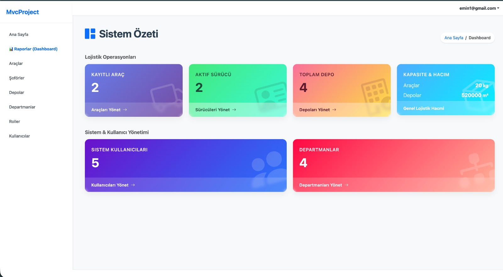
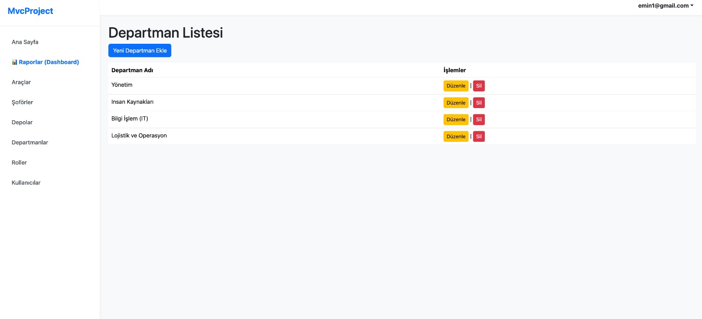
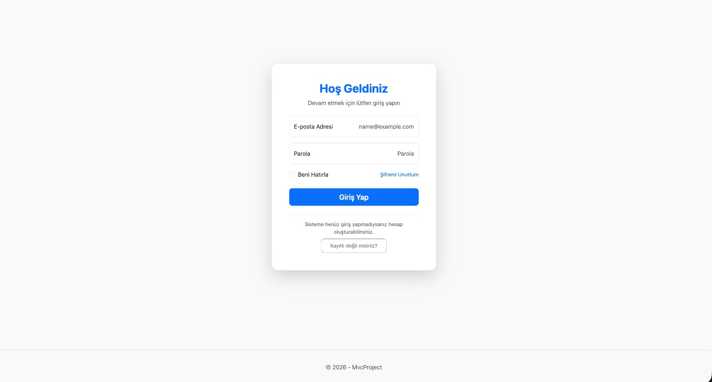
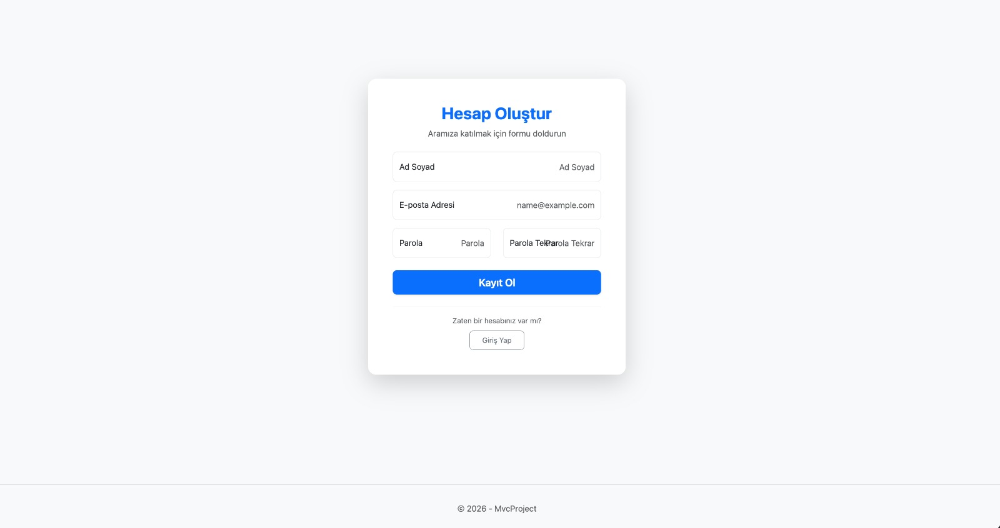

# (API-MVC) Lojistik Yönetim Sistemi

Bu proje, bir lojistik/filo yönetim sisteminin temelini oluşturan; RESTful API servisi ve kapsamlı bir Web yönetim panelinden oluşan bütünleşik bir çözümdür.

## 🏗 Mimari Yapı

Proje, `ApiMvcProject.slnx` çözüm dosyası altında iki ana katmanlı yapıda geliştirilmiştir:

### 1. ApiProject (RESTful Web API)

Sistemin veri sağlayan ve işleyen arka uç (backend) servisidir.

- **Teknolojiler:** ASP.NET Core Web API, Entity Framework Core
- **Veritabanı:** SQL Server (`ApiDatabase`)
- **Modeller:** `Vehicle` (Araç), `Driver` (Sürücü), `Depo` (Depo)
- **Özellikler:** Swagger/OpenAPI desteği ile standartlara uygun uç noktalar.

### 2. MvcProject (Web Uygulaması)

Lojistik varlıkların yönetildiği, kullanıcı doğrulama ve yetkilendirme süreçlerini barındıran yönetim panelidir.

- **Teknolojiler:** ASP.NET Core MVC, Entity Framework Core, Cookie Authentication
- **Veritabanı:** SQL Server (`MvcDatabase`)
- **Modeller:**
  - _Lojistik:_ `Vehicle`, `Driver`, `Depo`
  - _Kullanıcı:_ `User`, `Role`, `Department`
- **Özellikler:** Rol/Departman tabanlı yetkilendirme, güvenli oturum yönetimi ve tam kapsamlı CRUD işlemleri.

## 📸 Ekran Görüntüleri

<div align="center">
  
  <br/><i>Dashboard</i><br/><br/>

  
  <br/><i>Departmanlar</i><br/><br/>

  
  <br/><i>Login Ekranı</i><br/><br/>

  
  <br/><i>Kayıt Ekranı</i>
</div>
Diğer ekran görüntülerine screenshots adlı klasörden ulaşabilirsiniz.

## 🛠 Kurulum ve Çalıştırma

1. **Bağımlılıklar:** .NET 8.0 SDK ve SQL Server kurulumunun yapılmış olduğundan emin olun.
2. **Yapılandırma:** Her iki projenin (`ApiProject` ve `MvcProject`) `appsettings.json` dosyalarındaki `ConnectionStrings` kısmını kendi SQL Server yapılandırmanıza göre güncelleyin.
3. **Veritabanı değişiklikleri:**

   ```bash
   # ApiProject için
   cd ApiProject && dotnet ef database update

   # MvcProject için
   cd ../MvcProject && dotnet ef database update
   ```

4.
    ```bash
   # Çalıştırma:
   dotnet run
   ```

## 🚀 Nasıl Çalıştırılır?
Bu proje iki ayrı bileşenden oluştuğu için önce API'yi, ardından MVC uygulamasını çalıştırmalısınız. Ana depo kök dizininden (SOFTITO-BACKEND) terminalde şu adımları izleyin:

1. **Önce API projesini başlatın:**
```bash
dotnet run --project API-MVC/ApiProject/ApiProject.csproj
```
2. **Yeni bir terminal penceresi açın ve MVC projesini başlatın:**
```bash
dotnet run --project API-MVC/MvcProject/MvcProject.csproj
```
