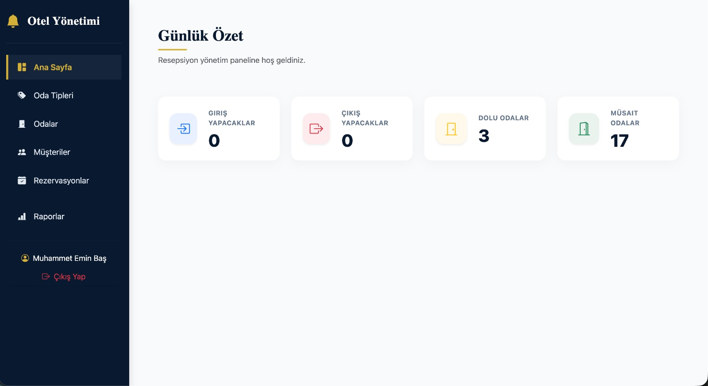
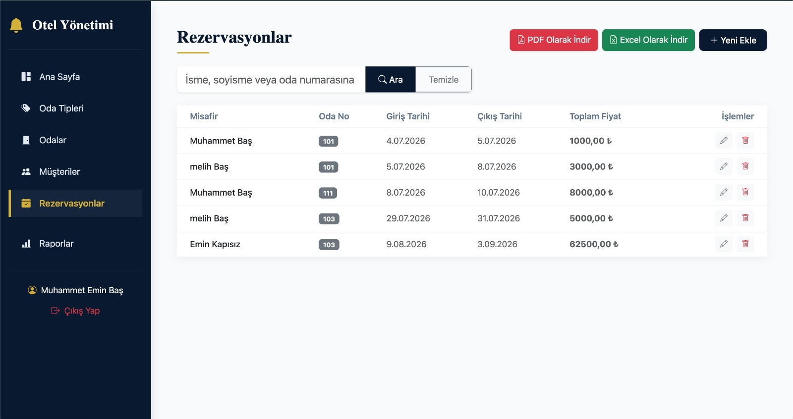
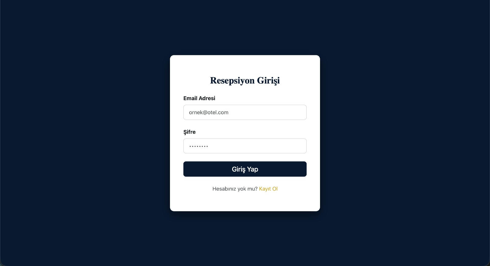
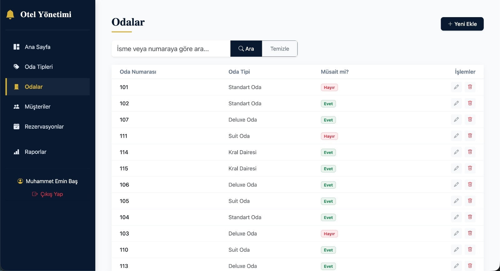
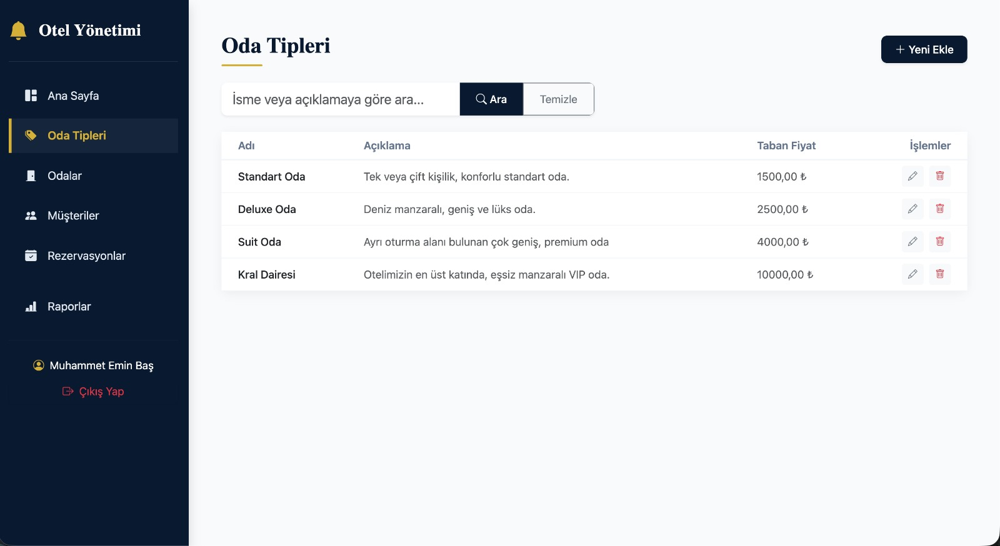
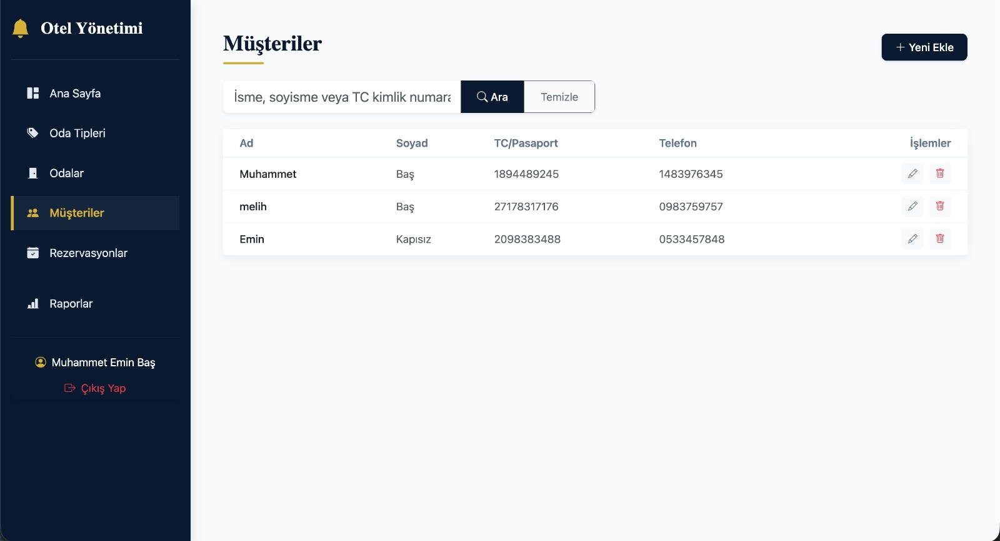
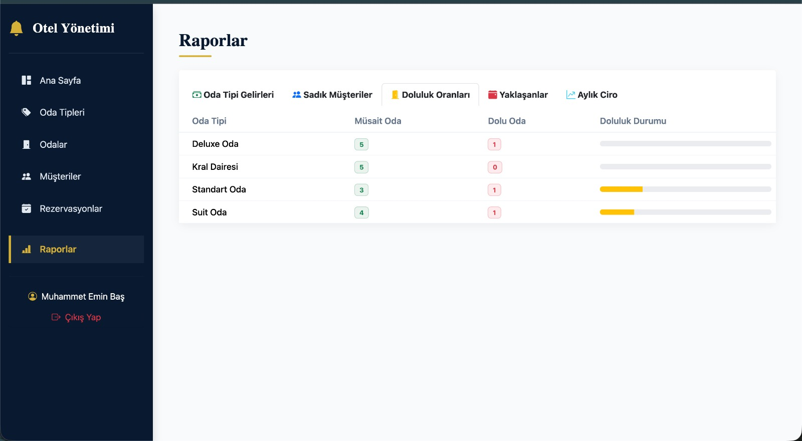
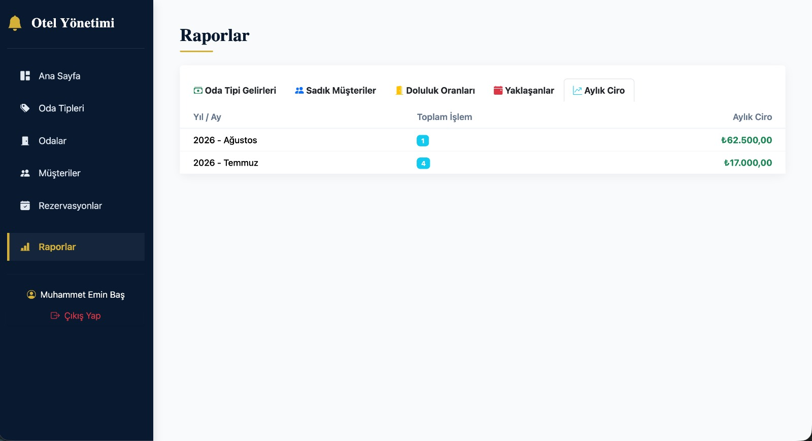

# Otel ve Rezervasyon Yönetim Sistemi 🏨

Bu proje, **.NET 10** üzerinde **Dapper (Micro-ORM)** ve **SQL Server** altyapısı kullanılarak geliştirilmiş, kurumsal ölçekte bir Otel ve Rezervasyon Yönetim Sistemidir. Sistem; arka uç (Web API) ve ön uç (MVC) olmak üzere ayrıştırılmış, güvenli ve performans odaklı bir mimariye sahiptir.

## 🏗 Mimari Yapı

Sistem iki temel katman üzerinden kurgulanmıştır:

### 1. ApiProject (Backend / RESTful API)

Uygulamanın veri işleme ve iş mantığı katmanıdır.

- **ORM:** Performans için **Dapper** kullanılmıştır.
- **Veritabanı:** SQL Server entegrasyonu; `Context.cs` ile otomatik tablo ve _Stored Procedure_ kurulumu.
- **Güvenlik:** Kullanıcı şifreleri **BCrypt.Net-Next** ile güvenli şekilde kriptolanır.
- **Dökümantasyon:** Geliştirme sürecini kolaylaştıran **Swagger** desteği.

### 2. MvcProject (Frontend / UI)

Yönetim ve kullanıcı etkileşim katmanıdır.

- **İletişim:** Veritabanına bağımlılığı minimize etmek adına **HttpClient (ApiService)** ile API üzerinden haberleşir.
- **Raporlama:** **QuestPDF** (PDF raporları) ve **EPPlus** (.xlsx raporları) ile kapsamlı veri dışa aktarımı.
- **Loglama:** **Serilog** ile dosya bazlı (`Logs/hotel-app-log-.txt`) kesintisiz hata ve süreç takibi.

## ✨ Temel Teknolojiler

- **.NET 10** (ASP.NET Core API & MVC)
- **Dapper** (Micro-ORM)
- **SQL Server**
- **BCrypt.Net-Next** (Güvenli Kimlik Doğrulama)
- **QuestPDF & EPPlus** (Gelişmiş Raporlama)
- **Serilog** (Operasyonel Loglama)

## 📸 Ekran Görüntüleri

_(Ekran görüntülerini `screenshots/` klasörüne ekleyip aşağıda referanslarını güncelleyebilirsin)_

<div align="center">
  
  <br/><i>Otel Yönetim Paneli ve İstatistikler</i><br/><br/>

  
  <br/><i>Rezervasyon Takip Ekranı</i><br/><br/>

  
  <br/><i>Login Ekranı</i><br/><br/>

  
  <br/><i>Odalar</i><br/><br/>

  
  <br/><i>Oda tipleri</i><br/><br/>

  
  <br/><i>Müşteriler</i><br/><br/>

  
  <br/><i>Doluluk Oranları - Raporlama</i><br/><br/>

  
  <br/><i>Ciro Görüntüleme - Raporlama</i><br/><br/>
</div>

## 🛠 Kurulum

1. **Bağlantı:** Her iki projenin `appsettings.json` dosyalarındaki veritabanı bağlantı dizelerini güncelleyin.
2. **Derleme:**
   ```bash
   dotnet build
   ```
3. **Projeleri Çalıştırın**
   API ve MVC projelerini aynı anda çalıştırmak için iki ayrı terminal kullanın:
   - **API Projesi için:**

     ```bash
     cd ApiProject && dotnet run
     ```

   - **MVC Projesi için:**
     ```bash
     cd MvcProject && dotnet run
     ```
     _(Eğer Visual Studio kullanıyorsanız "Multiple Startup Projects" özelliğini aktif ederek tek seferde başlatabilirsiniz.)_
