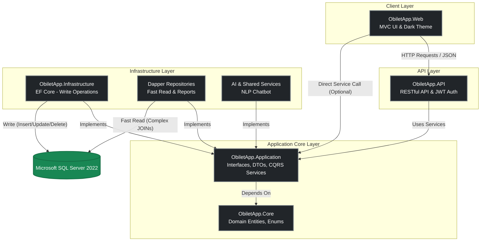
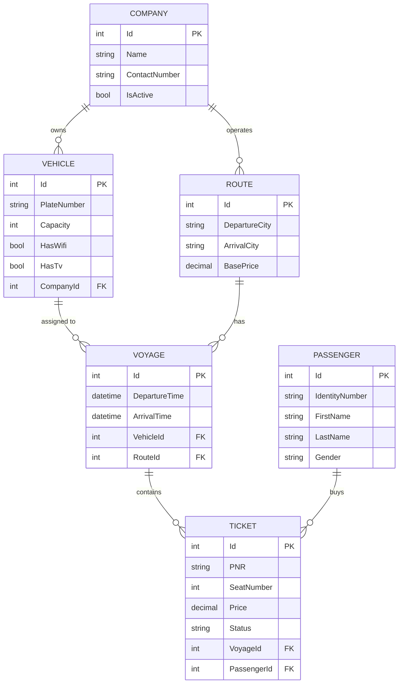

<div align="center">
  
  
  
  
  
</div>

<br />

<div align="center">
  <h1 align="center">🚌 ObiletApp - Yeni Nesil Otobüs Bileti Rezervasyon ve Yönetim Sistemi</h1>
  <p align="center">
    <strong>Clean Architecture</strong> ve <strong>CQRS</strong> prensipleriyle inşa edilmiş, yüksek performanslı ve tam donanımlı kurumsal B2B/B2C çözümü.
    <br />
    <br />
    <a href="#-proje-hakkında">Proje Hakkında</a>
    ·
    <a href="#-mimari-yapı-clean-architecture">Mimari Yapı</a>
    ·
    <a href="#-kapsamlı-özellikler">Özellikler</a>
    ·
    <a href="#-kurulum-ve-kullanım">Kurulum</a>
  </p>
</div>

---

## 📖 Proje Hakkında

**ObiletApp**, otobüs firmaları ve yolcuları dijital bir platformda buluşturan, uçtan uca yönetilebilir bir bilet rezervasyon sistemidir. Günümüz modern yazılım mühendisliği standartlarına uygun olarak tasarlanan bu proje, sadece çalışan bir web sitesi olmakla kalmaz; arka planda mikroservis mantığına uygun, genişletilebilir ve sağlam bir altyapı barındırır.

Kullanıcılar sisteme girip seferleri filtreleyebilir, dinamik koltuk haritası üzerinden istedikleri koltuğu seçip güvenle satın alabilirler. Bilet işlemi sonrasında oluşan PNR kodu ve özel olarak üretilen **QR Kod** sayesinde dijital biletlerini her an yanlarında taşıyabilirler. Sistem yöneticileri ise gelişmiş Admin Paneli sayesinde firmaları, güzergahları, seferleri ve kampanyaları yönetirken, sistemin ürettiği karmaşık finansal verileri **Excel** ve **PDF** raporlarına dönüştürebilirler.

Sistem, yapay zeka destekli bir **NLP Akıllı Asistan (Chatbot)** barındırarak kullanıcı deneyimini bir üst seviyeye taşır.

---

## 🏗 Mimari Yapı (Clean Architecture)

Aşağıdaki şema, sistemin arka planında çalışan modüler, genişletilebilir ve güvenlik odaklı kurumsal mimariyi özetlemektedir:



Proje sürdürülebilirliği artırmak, bağımlılıkları (coupling) azaltmak ve test edilebilirliği en üst düzeye çıkarmak için **Onion/Clean Architecture** tasarım deseni kullanılarak 4 ana katmana ayrılmıştır:

1. **ObiletApp.Core (Domain Layer):** 
   Sistemin kalbidir. Hiçbir dış kütüphaneye bağımlı değildir. Bütün `Entity` (Varlık) sınıfları (Örn: *Ticket, Passenger, Company, Vehicle*) ve temel arayüzler (Interfaces) burada yer alır.
2. **ObiletApp.Application (Use Cases Layer):**
   İş kurallarının (Business Logic) işlendiği yerdir. DTO'lar, Mapping işlemleri, CQRS (Command Query Responsibility Segregation) pattern ile tasarlanmış servisler burada tutulur. 
3. **ObiletApp.Infrastructure (Data & Cross-Cutting Layer):**
   Veritabanı işlemleri ve dış servis bağlantılarının bulunduğu katmandır. **Repository Pattern** kullanılarak veritabanı soyutlanmıştır. Write (Yazma/Değiştirme) işlemleri için güvenliğiyle öne çıkan **Entity Framework Core (Code-First)**, karmaşık Read (Okuma/Raporlama) işlemleri için ise maksimum performans sağlayan mikro-ORM **Dapper** eşzamanlı olarak kullanılmıştır.
4. **ObiletApp.Web & ObiletApp.API (Presentation Layer):**
   Kullanıcının ve diğer sistemlerin etkileşime geçtiği yüzdür. Web tarafı **ASP.NET Core MVC** ile geliştirilmiş olup Bootstrap 5 ile şekillendirilmiştir. API tarafı ise mobil uygulamalar veya dış servisler için tasarlanmış, **JWT Token** ile korunan tamamen RESTful bir altyapıya sahiptir.

---

## 🗄 Veritabanı Şeması (ER Diagram)

Projenin arkasında yatan sağlam veritabanı ilişkilerini aşağıdaki Entity-Relationship (ER) şemasından inceleyebilirsiniz:



---

## 📂 Proje Klasör Yapısı (Solution Tree)

Aşağıdaki yapı, **Clean Architecture** prensiplerinin klasör düzeyinde nasıl titizlikle uygulandığını göstermektedir:

```text
ObiletApp/
├── ObiletApp.Core/                  # [Domain Layer] Dışa bağımlılığı SIFIR olan çekirdek
│   ├── Entities/                    # Veritabanı tablolarının C# karşılıkları (Vehicle, Ticket vb.)
│   ├── Enums/                       # Cinsiyet, Bilet Durumu gibi sabitler
│   └── Interfaces/                  # IRepository gibi temel soyutlamalar
│
├── ObiletApp.Application/           # [Use Cases Layer] İş Kuralları
│   ├── DTOs/                        # Veri transfer objeleri (Frontend'e giden hafifleştirilmiş veriler)
│   ├── Mapping/                     # Entity -> DTO dönüşümleri (AutoMapper)
│   └── Services/                    # Gerçek iş mantığının (Business Logic) yazıldığı yer
│
├── ObiletApp.Infrastructure/        # [Data Layer] Veritabanı ve Dış Servisler
│   ├── Data/                        # ApplicationDbContext (EF Core) konfigürasyonları
│   ├── Repositories/                # EF Core (Generic) ve Dapper için Repository pattern uygulamaları
│   └── Migrations/                  # Veritabanı versiyon kontrolü
│
├── ObiletApp.API/                   # [Presentation - 1] RESTful Servisler
│   ├── Controllers/                 # Swagger ile test edilebilen, JWT korumalı endpointler
│   └── Program.cs                   # API ayağa kalkış ayarları ve DI Container
│
└── ObiletApp.Web/                   # [Presentation - 2] MVC Kullanıcı Arayüzü
    ├── Controllers/                 # Admin ve Müşteri sayfalarının yönlendiricileri
    ├── Views/                       # HTML/CSS/JS/Razor dosyaları (UI)
    └── wwwroot/                     # Statik dosyalar, Bootstrap, JS scriptleri
```

---

## 🚀 Kapsamlı Özellikler

### 👤 Müşteri (B2C) Özellikleri
- **Kapsamlı Arama & Dinamik Filtreleme:** Kullanıcılar kalkış ve varış noktalarını, tarihleri girerek aktif seferleri listeleyebilir; saat, firma ve fiyata göre anlık filtreleme yapabilir.
- **Canlı Koltuk Seçimi:** Araç kapasitesine göre dinamik çizilen koltuk haritası üzerinden boş koltukların (Kadın/Erkek yan yana oturma kurallarına göre) seçilmesi.
- **Akıllı Asistan (Chatbot):** NLP mantığı ile çalışan entegre yapay zeka botu. Kullanıcılar *"Bagaj hakkım nedir?", "Biletimi nasıl iptal edebilirim?"* gibi sorular sorduğunda anında doğru ve yönlendirici cevaplar alır.
- **PNR Kodu ve QR Kod:** Bilet alındığında sistem otomatik olarak benzersiz bir PNR üretir. Kullanıcı ekranında oluşan **QR Kod** sayesinde bilet dijital olarak doğrulanabilir.
- **Bilet İptal & Sorgulama:** Kullanıcılar üye dahi olmadan sadece PNR numarası ile bilet detaylarına ulaşabilir veya sefer saatine belli bir süre kalana dek biletlerini iptal edebilirler.

### 🛡 Admin ve Yönetim (B2B) Özellikleri
- **Rol Tabanlı Kimlik Doğrulama:** ASP.NET Core Identity altyapısı kullanılarak SuperAdmin, Firma Yöneticisi gibi farklı rol hiyerarşileri oluşturulmuştur.
- **Gelişmiş CRUD ve İlişkisel Yönetim:** 
  - **Araçlar & Filo:** Otobüslerin plaka, koltuk kapasitesi ve Wi-fi/TV özelliklerinin yönetimi.
  - **Firmalar & Güzergahlar:** Platformda bilet satan firmaların (Kamil Koç, Pamukkale vb.) ve sefer yapılan şehir/lokasyon verilerinin yönetimi.
  - **Kampanyalar:** Dinamik kampanya afişleri ve indirim kodlarının sisteme girilmesi.
- **Dapper Destekli Detaylı Raporlar:** Admin paneli, klasik Entity Framework'ün yavaş kalabileceği çoklu tablo (JOIN) sorgularını saf SQL gücüyle **Dapper** kullanarak çeker. "Aylık en çok bilet satan firma", "Doluluk oranı en yüksek sefer" gibi analizler saniyeler içinde sunulur.
- **Excel & PDF Dışa Aktarma:** Yöneticiler, oluşturdukları raporları tek tıkla **ClosedXML** kütüphanesi sayesinde Excel dosyası olarak indirebilir, muhasebeye sunabilir.

### 🔌 Teknik & Sistem Özellikleri
- **Güvenli RESTful API:** Tüm sistem fonksiyonları dış sistemlere (Örn: iOS/Android app) açılmak üzere API katmanında yazılmıştır. Endpoints'ler izinsiz girişleri önlemek için **JWT (JSON Web Token)** kullanılarak şifrelenmiştir.
- **Swagger Dokümantasyonu:** API mimarisinin tamamı Swagger UI ile belgelenmiş olup, front-end veya mobil geliştiricilerin API'yi zahmetsizce test etmesi sağlanmıştır.
- **SweetAlert2 ve Asenkron UI:** Sistemdeki ekleme, silme, bilet satın alma gibi kritik uyarılarda standart Javascript alertleri yerine kullanıcı dostu modern pop-up'lar (SweetAlert2) kullanılmıştır. AJAX tabanlı asenkron yüklemelerle sayfa yenilenmeden işlem yapılır.

---

## 📸 Ekran Görüntüleri ve Arayüz

### Kullanıcı Deneyimi (Bilet Alım Süreci)
| Ana Sayfa | Sefer Sonuçları ve Filtreleme |
| :---: | :---: |
|  |  |

| Koltuk Seçimi | Bilet İptal / Sorgulama |
| :---: | :---: |
|  |  |

| Akıllı Asistan (Chatbot) | Kullanıcı Giriş |
| :---: | :---: |
|  |  |

### Admin Yönetim Paneli
| Dashboard ve Analitik | Gelişmiş Raporlar (Dapper) |
| :---: | :---: |
|  |  |

| Firma Yönetimi | Dinamik Arama (Search) |
| :---: | :---: |
|  |  |

### API ve Dokümantasyon
| Genel API Yapısı | Dapper Güçlü Endpointler |
| :---: | :---: |
|  |  |

---

## 💻 Kurulum ve Çalıştırma Adımları

Bu projeyi bilgisayarınızda (localhost) çalıştırmak için aşağıdaki adımları sırasıyla uygulayabilirsiniz:

### Gereksinimler
- [.NET 10.0 SDK](https://dotnet.microsoft.com/download) (veya en güncel sürüm)
- Microsoft SQL Server (LocalDB veya SSMS üzerinden uzak sunucu)
- Visual Studio 2022 veya Visual Studio Code

### Adım Adım Kurulum

1. **Projeyi Klonlayın:**
   ```bash
   git clone https://github.com/eminbs57/SOFTITO-BACKEND.git
   cd SOFTITO-BACKEND/Bitirme_Projesi/ObiletApp
   ```

2. **Veritabanı Bağlantısını (Connection String) Güncelleyin:**
   Kök dizindeki `ObiletApp.Web/appsettings.json` ve `ObiletApp.API/appsettings.json` dosyalarını açıp, SQL Server bağlantı dizenizi kendi yerel veritabanı adınıza göre güncelleyin.
   ```json
   "ConnectionStrings": {
     "DefaultConnection": "Server=(localdb)\\mssqllocaldb;Database=ObiletAppDb;Trusted_Connection=True;MultipleActiveResultSets=true"
   }
   ```

3. **Veritabanını ve Tabloları Oluşturun (Migrations):**
   Projeyi ayağa kaldırmadan önce Code-First mimarisindeki veritabanı tablolarını SQL sunucusuna basmalısınız. Terminalden aşağıdaki komutu çalıştırın:
   ```bash
   dotnet ef database update --project ObiletApp.Infrastructure --startup-project ObiletApp.Web
   ```

4. **Projeyi Başlatın:**
   Her şey hazır. MVC Web projesini ayağa kaldırmak için:
   ```bash
   dotnet run --project ObiletApp.Web
   ```

5. **Test Edin:**
   - Web arayüzü: `https://localhost:5120` (veya konsolda belirtilen port)
   - API Dokümantasyonu (Swagger): `https://localhost:5121/swagger`

---

## 👨‍💻 Geliştirici ve İletişim

**Muhammet Emin Baş**  
Bu proje, Softito eğitim programı kapsamında geliştirilmiş bir **Mezuniyet / Bitirme Projesidir**. Modern yazılım mühendisliği prensiplerini gerçek dünya senaryolarına (Bilet Rezervasyon Sistemi) uygulamak amacıyla titizlikle kodlanmıştır.
