# 🚌 ObiletApp - Otobüs / Uçak Bileti Rezervasyon & Yönetim Sistemi

**ObiletApp**, modern web teknolojileri ve kurumsal yazılım mimarisi standartları (Clean Architecture) kullanılarak geliştirilmiş, uçtan uca kapsamlı bir Otobüs /Uçak Bileti Rezervasyon ve Yönetim Sistemidir. Gelişmiş bir Admin paneli, RESTful API desteği, yapay zeka destekli akıllı asistanı ve kullanıcı dostu ön yüzü ile tam teşekküllü bir B2C ve B2B çözümü sunar.

## 🌟 Öne Çıkan Özellikler

*   **Clean Architecture (Temiz Mimari):** Proje; Core, Application, Infrastructure ve Presentation (Web/API) katmanlarına ayrılarak sürdürülebilir, test edilebilir ve bağımlılıkları minimize edilmiş bir yapıda kurgulanmıştır.
*   **CQRS & Repository Pattern:** Veritabanı okuma/yazma işlemleri profesyonel tasarım desenleri ile birbirinden ayrıştırılmıştır.
*   **Çift ORM Kullanımı (EF Core + Dapper):** 
    *   Veri ekleme, güncelleme ve silme (Command) işlemleri için güvenli **Entity Framework Core**.
    *   Veri listeleme ve kompleks rapor (Query) işlemleri için yüksek performanslı mikro-ORM **Dapper**.
*   **Kapsamlı Admin Paneli:** Güzergahlar, Firmalar, Araçlar, Seferler, Kampanyalar, Biletler ve Yolcular için gelişmiş CRUD işlemleri.
*   **Gelişmiş Raporlama:** Dapper kullanılarak birden fazla tablonun (JOIN) birleştirilmesiyle oluşturulan, anlık finansal ve operasyonel raporlar.
*   **Akıllı Asistan (Chatbot):** NLP kurallarıyla çalışan, kullanıcıların "Bagaj hakkı", "Bilet iptali" gibi sorularına saniyeler içinde cevap veren entegre yapay zeka asistanı.
*   **RESTful API & Swagger:** Sistemin tüm özelliklerini dışa açan, **JWT (JSON Web Token)** ile korunan ve mobil/dış sistemlere entegre olmaya hazır tam belgelenmiş API katmanı.
*   **Gerçek Zamanlı Filtreleme & Bilet Alma:** Seferlerin dinamik olarak filtrelenmesi, koltuk seçimi ve PNR koduyla bilet iptal/sorgulama modülü.

---

## 📸 Ekran Görüntüleri

### Kullanıcı Arayüzü (Bilet Alma & Sorgulama)
| Ana Sayfa | Sefer Sonuçları ve Filtreleme |
| :---: | :---: |
| 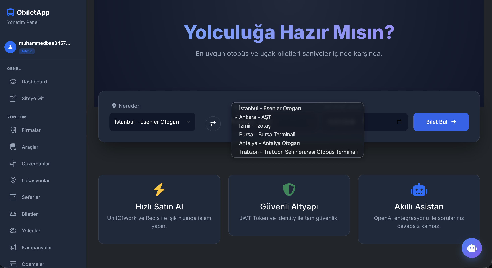 | 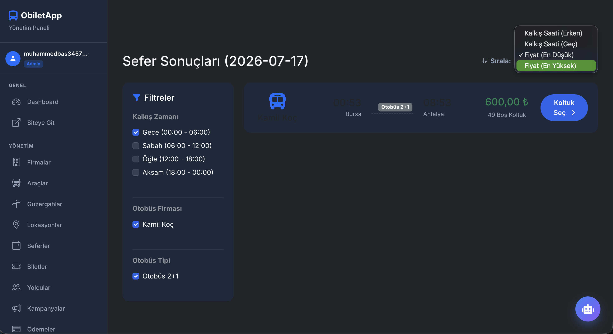 |

| Koltuk Seçimi | Bilet İptal / Sorgulama |
| :---: | :---: |
| 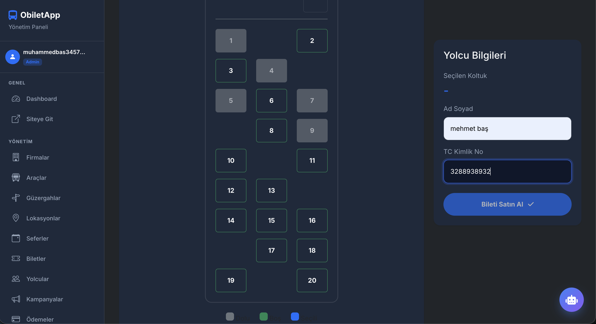 | 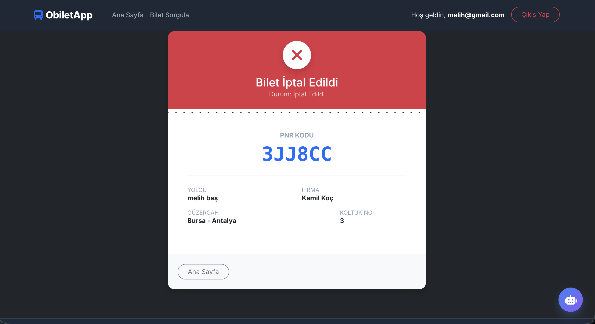 |

| Akıllı Asistan (Chatbot) | Kullanıcı Giriş |
| :---: | :---: |
| 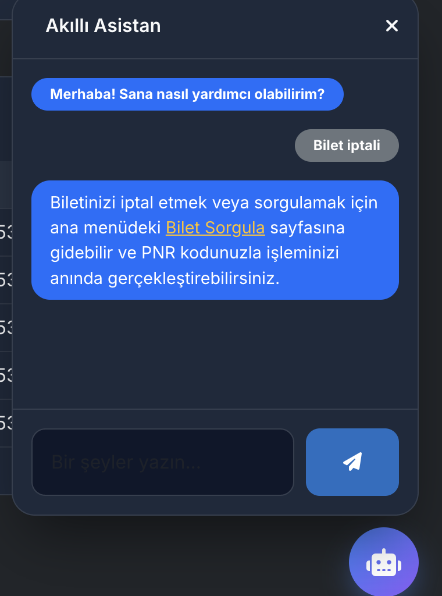 | 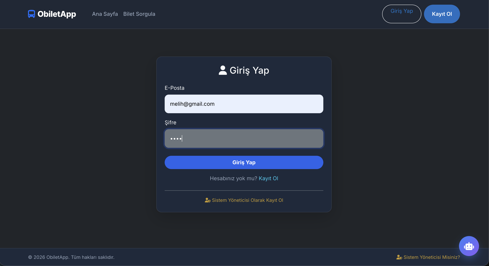 |

### Admin Paneli (Yönetim & Raporlama)
| Dashboard | Gelişmiş Raporlar (Dapper) |
| :---: | :---: |
| 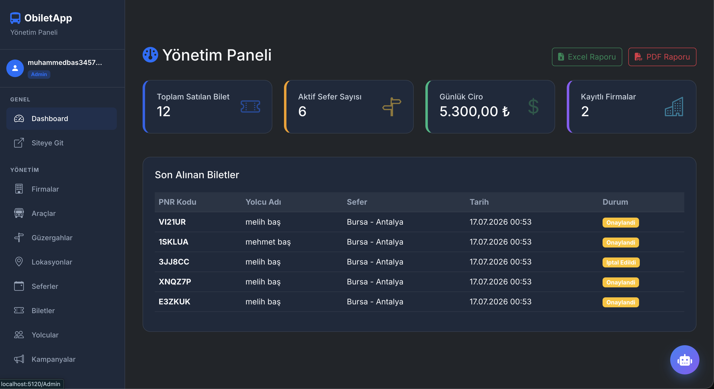 | 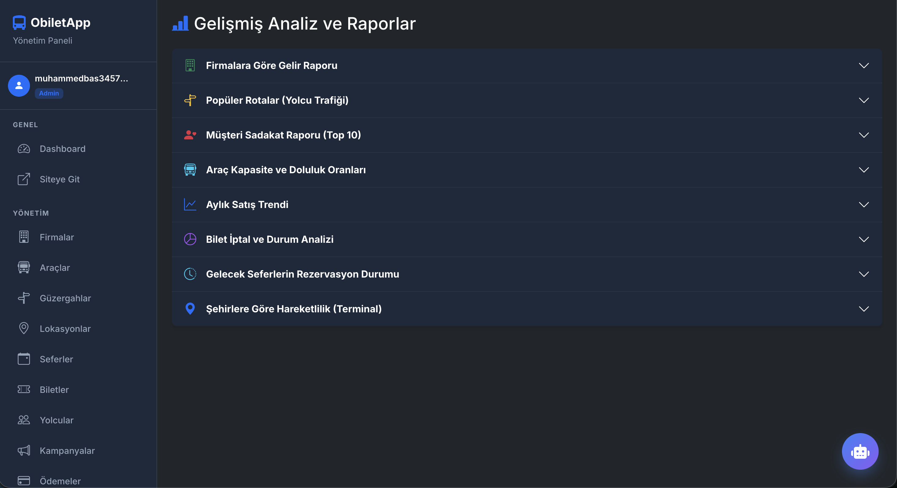 |

| Firma Yönetimi | Sefer Yönetimi |
| :---: | :---: |
| 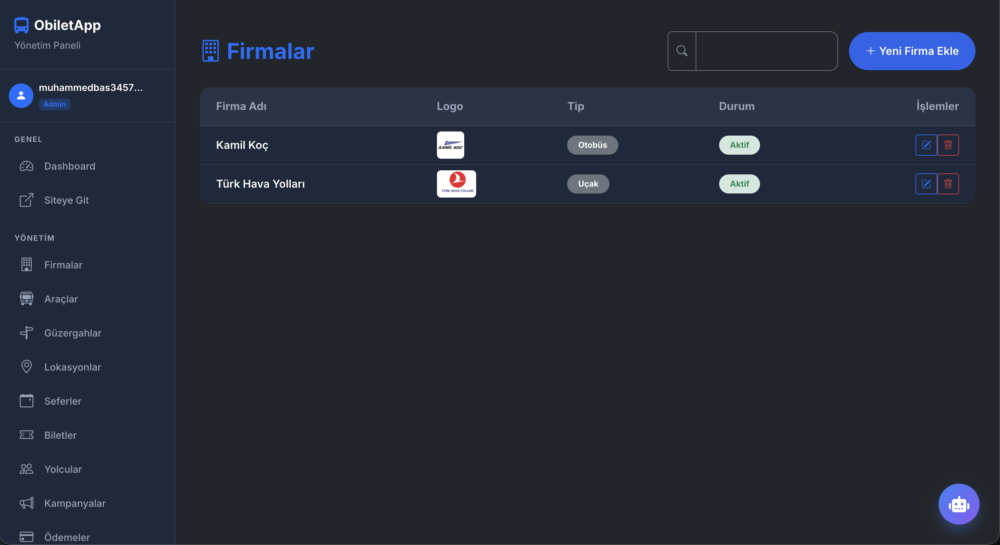 | 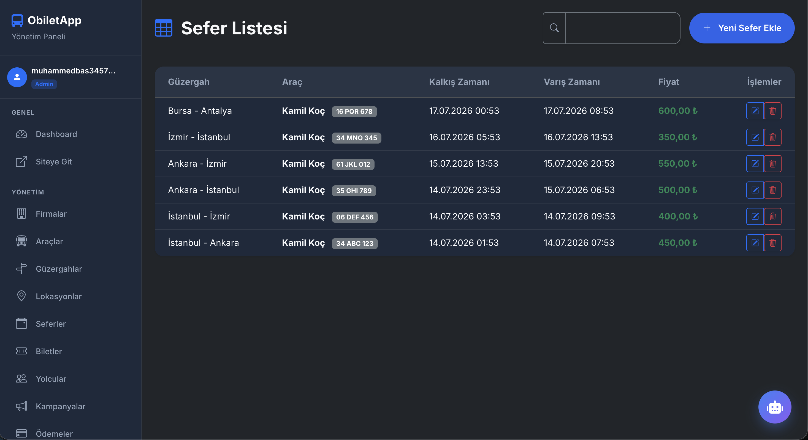 |

| Kampanya Yönetimi | Dinamik Arama (Search) |
| :---: | :---: |
| 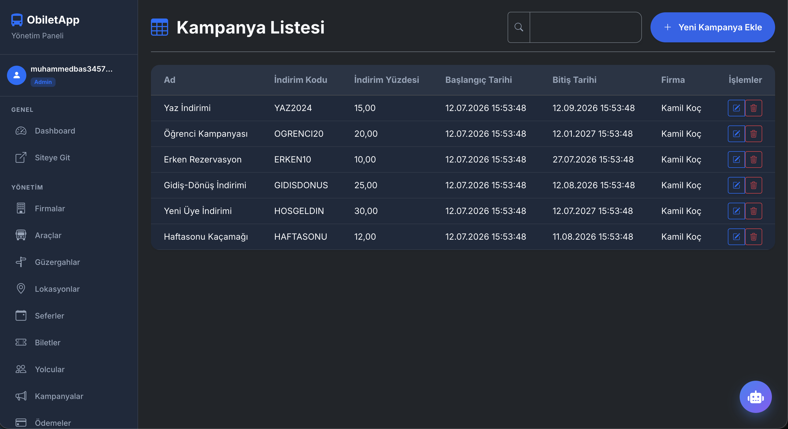 | 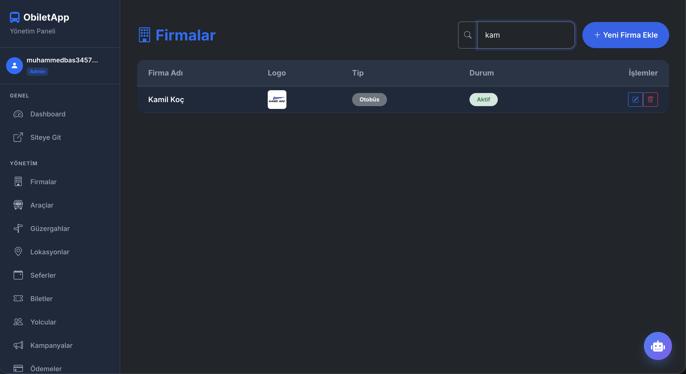 |

### API & Dokümantasyon (Swagger)
Sistemin arkasında çalışan güçlü API mimarisi Swagger ile belgelenmiştir.

| Genel API Yapısı | Dapper Endpointleri |
| :---: | :---: |
| 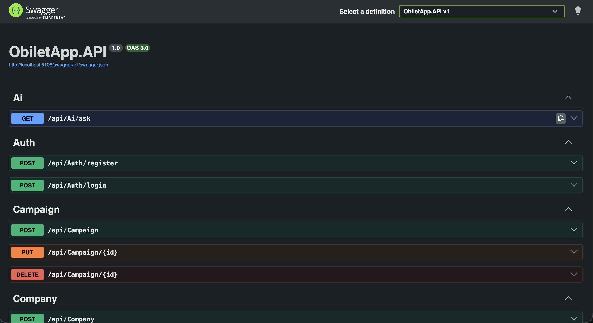 | 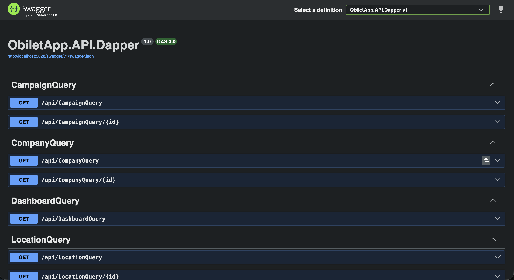 |

> 💡 **Not:** Projeye ait diğer tüm detaylı ekran görüntülerine yukarıdaki dosya listesinden `screenshots` klasörüne tıklayarak erişebilirsiniz.

---

## 🛠 Kullanılan Teknolojiler
*   **Backend:** C#, .NET Core, ASP.NET Core MVC, ASP.NET Core Web API
*   **Mimari:** Clean Architecture, Repository Pattern, CQRS, Dependency Injection
*   **Veritabanı & ORM:** Microsoft SQL Server, Entity Framework Core (Code-First), Dapper
*   **Frontend:** HTML5, CSS3, JavaScript, Bootstrap 5, FontAwesome
*   **Kimlik Doğrulama ve Güvenlik:** ASP.NET Core Identity (IdentityRole, IdentityUser), **JWT (JSON Web Token)** Authentication

## 🚀 Kurulum ve Çalıştırma

1.  Projeyi bilgisayarınıza indirin (clone).
2.  `ObiletApp.Web` ve `ObiletApp.API` klasörleri içindeki `appsettings.json` dosyalarından veritabanı bağlantı cümlenizi (`ConnectionString`) güncelleyin.
3.  Terminal veya Package Manager Console üzerinden veritabanını oluşturun:
    ```bash
    dotnet ef database update --project ObiletApp.Infrastructure --startup-project ObiletApp.Web
    ```
4.  Projeyi başlatmak için:
    ```bash
    dotnet run --project ObiletApp.Web
    ```
5.  Uygulama ayağa kalktığında hem MVC paneline hem de `/swagger` adresi üzerinden API dökümantasyonuna erişebilirsiniz.


