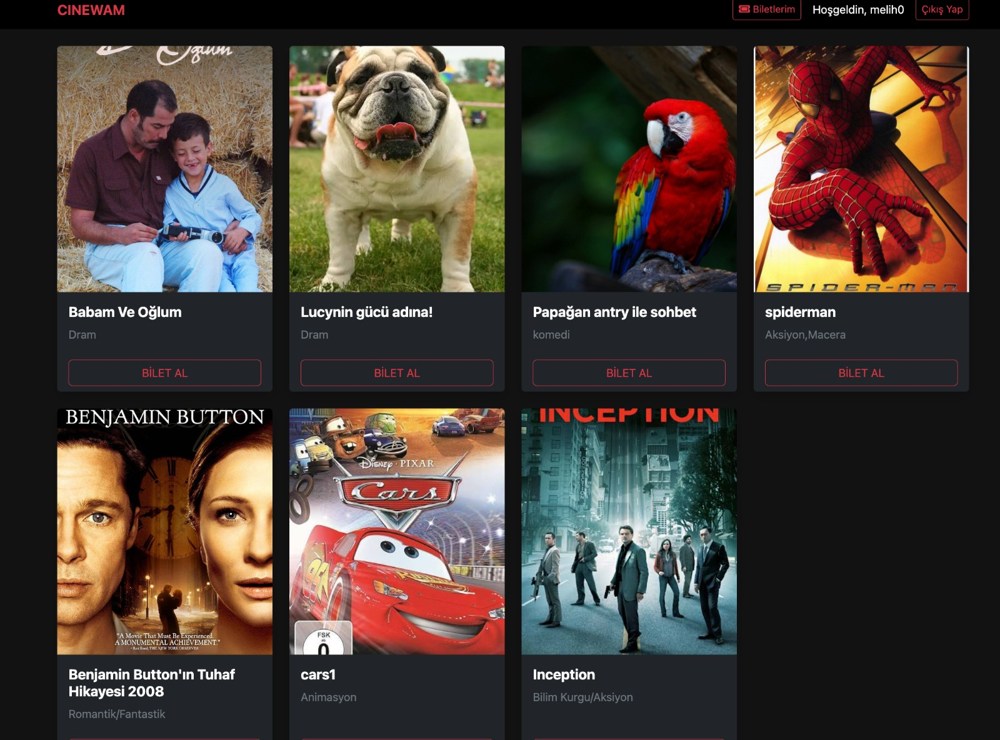
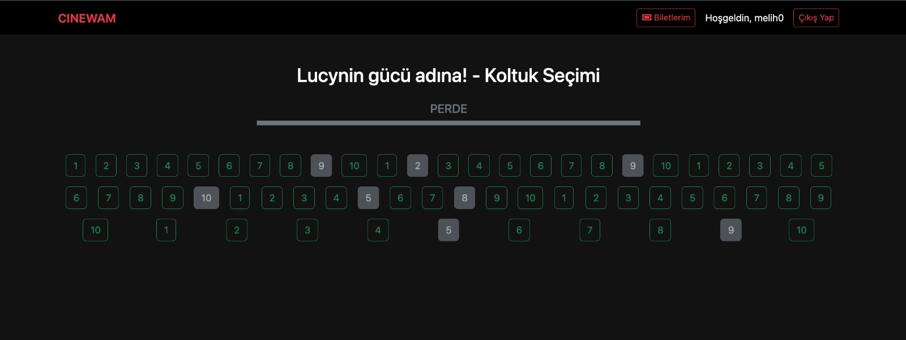
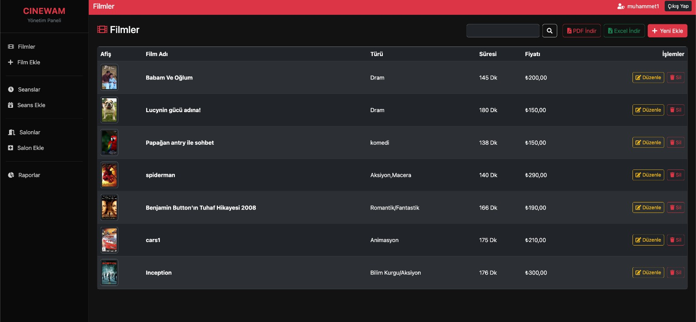
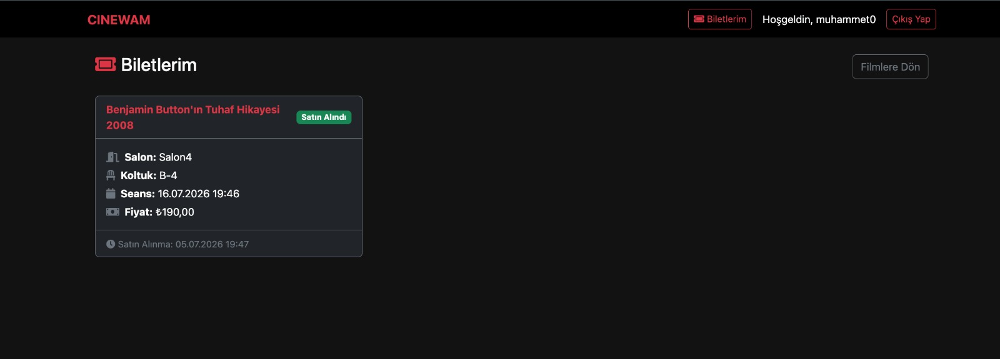
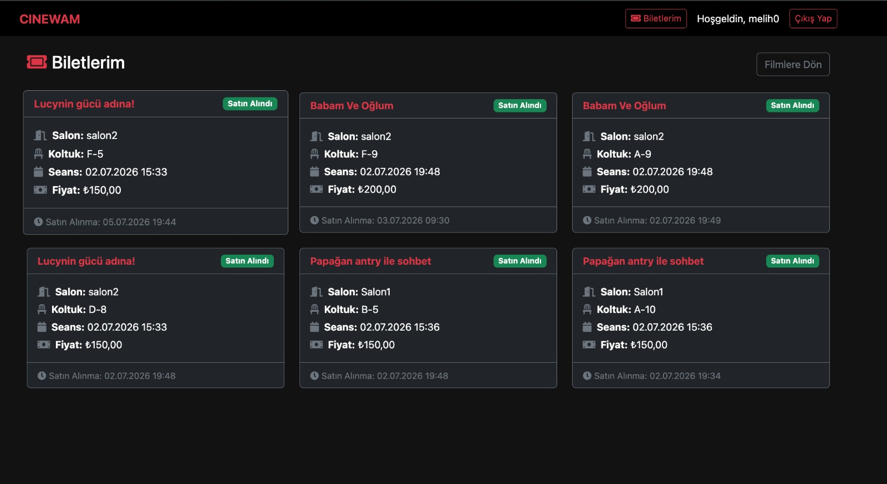
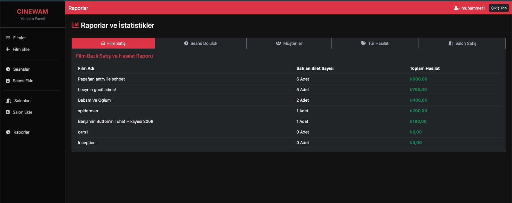

# CINEWAM - Sinema Bilet Otomasyon Sistemi (Database-First)



CINEWAM, mevcut bir veritabanı yapısı üzerinden **Database-First** yaklaşımıyla geliştirilmiş, sinema bilet satış ve yönetim süreçlerini optimize eden kapsamlı bir otomasyondur. ASP.NET Core MVC mimarisi ile inşa edilen sistem, hem admin hem de kullanıcı taraflı dinamik özellikler sunar.

## 🚀 Teknolojiler ve Kütüphaneler

*   **Platform:** .NET 8.0/10.0

*   **Mimari:** ASP.NET Core MVC (Database-First Approach)

*   **Veritabanı Erişimi:** Entity Framework Core & SQL Server

*   **Kimlik Doğrulama:** ASP.NET Core Identity (Role-based Authorization)

*   **Performans & Optimizasyon:** 

    *   `IMemoryCache` (Yüksek performanslı veri arama)

    *   Karmaşık `JOIN` operasyonları ile optimize edilmiş veri sorgulama

*   **Loglama:** Serilog (Dosya tabanlı detaylı izleme)

*   **Raporlama:** `QuestPDF` (PDF) ve `EPPlus` (Excel) entegrasyonu

*   **Arayüz:** Bootstrap 5

## 🌟 Temel Özellikler

### Yönetim Paneli (Admin)

*   **Film ve Seans Yönetimi:** Database-First yaklaşımıyla veritabanına doğrudan entegre film ve seans takibi.

*   **Salon ve Koltuk Sistemi:** Kapasite yönetimi ve dinamik koltuk konfigürasyonu.

*   **Gelişmiş Raporlama:** Satış hacmi, doluluk oranları ve salon bazlı ciro analizlerini **PDF** ve **Excel** olarak dışa aktarabilme.

*   **Performans İzleme:** `IMemoryCache` ile veritabanı üzerindeki okuma yükünü minimize eden hızlı arama altyapısı.

### Kullanıcı Deneyimi

*   **Güvenli Erişim:** Identity mimarisiyle yönetilen üyelik sistemi.

*   **Biletleme:** Görselleştirilmiş koltuk seçimi ve kullanıcıya özel bilet geçmişi sayfası.

## 📄 Loglama ve İzlenebilirlik

Proje, `Logs` klasörü altında günlük olarak `txt` formatında detaylı operasyonel loglar tutmaktadır.

## 📸 Ekran Görüntüleri 

<div align="center">

  

  <br/>

  <i>İlgili Filme Ait Kullanıcı Koltuk Secim Ekranı</i>

  <br/><br/>

  

  <br/>

  <i>Admin Film Listeleme Ekranı</i>

  <br/><br/>

  

  <br/>

  <i>Kullanıcının Kendine Ait Bilet Görüntüleme Ekranı</i>

  <br/><br/>

  

  <br/>

  <i>Baska Bir Kullanıcının Kendine Ait Bilet Görüntüleme Ekranı</i>

  <br/><br/>

  

  <br/>

  <i>Örnek Rapor sayfası (Toplam Hasılat)</i>

</div>

> 💡 **Not:** Projeye ait diğer tüm detaylı ekran görüntülerine yukarıdaki dosya listesinden `screenshots` klasörüne tıklayarak erişebilirsiniz.

## 🚀 Adım Adım Nasıl Çalıştırılır?

Bu proje **Database-First** (Önce Veritabanı) yaklaşımı ile geliştirildiği için, projeyi çalıştırmadan önce veritabanı bağlantılarınızı ayarlamanız gerekmektedir. Aşağıdaki adımları sırasıyla izleyin:

1. **Veritabanı Bağlantısını Ayarlama:**
   - Proje içerisindeki `DBFİRST/SinemaDbFirst/appsettings.json` dosyasını açın.
   - `ConnectionStrings` altındaki bağlantı cümlesini (Connection String) kendi lokal SQL Server sunucunuza uygun şekilde güncelleyin.
   *(Eğer projenin çalışması için gereken hazır bir SQL script dosyası varsa öncelikle onu SQL Server'da çalıştırarak veritabanını oluşturun.)*

2. **Terminali Açma:**
   - Ana depo kök dizininde (`SOFTITO-BACKEND` klasörü içinde) bir terminal veya komut satırı açın.

3. **Projeyi Başlatma:**
   - Aşağıdaki komutu çalıştırarak projeyi ayağa kaldırın:
   ```bash
   dotnet run --project DBFİRST/SinemaDbFirst/dbfirstProjem.csproj
   ```

4. **Kullanım:**
   - Proje başarıyla derlendikten sonra, terminalde belirtilen `http://localhost:<port>` adresi üzerinden tarayıcınızda uygulamayı görüntüleyebilirsiniz.
