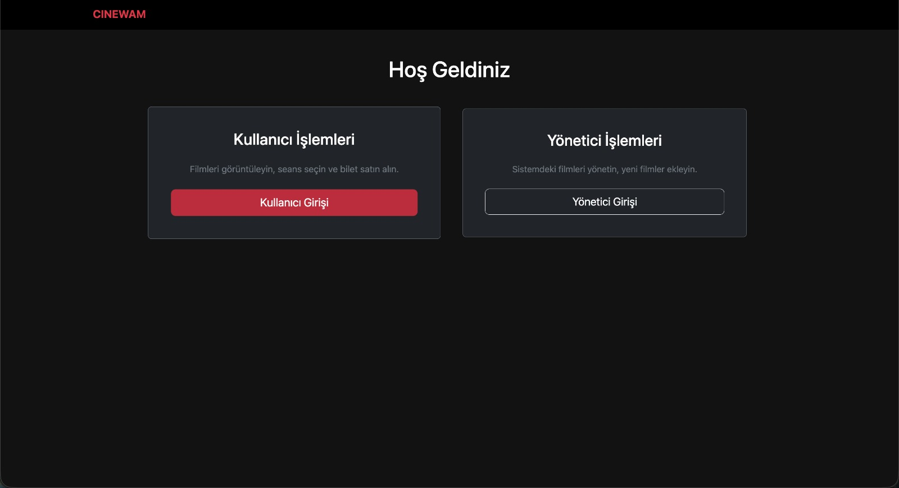

# CINEWAM - Sinema Bilet Otomasyon Sistemi (Database-First)

CINEWAM, mevcut bir veritabanı yapısı üzerinden **Database-First** yaklaşımıyla geliştirilmiş, sinema bilet satış ve yönetim süreçlerini optimize eden kapsamlı bir otomasyondur. ASP.NET Core MVC mimarisi ile inşa edilen sistem, hem admin hem de kullanıcı taraflı dinamik özellikler sunar.

## 🚀 Teknolojiler ve Kütüphaneler

*   **Platform:** .NET 8.0/10.0

*   **Mimari:** ASP.NET Core MVC (Database-First Approach)

*   **Veritabanı Erişimi:** Entity Framework Core & SQL Server

*   **Kimlik Doğrulama:** ASP.NET Core Identity (Role-based Authorization)

*   **Performans & Optimizasyon:** 

    *   `IMemoryCache` (Yüksek performanslı veri arama)

    *   Karmaşık `JOIN` operasyonları ile optimize edilmiş veri sorgulama

*   **Loglama:** Serilog (Dosya tabanlı detaylı izleme)

*   **Raporlama:** `QuestPDF` (PDF) ve `EPPlus` (Excel) entegrasyonu

*   **Arayüz:** Bootstrap 5

## 🌟 Temel Özellikler

### Yönetim Paneli (Admin)

*   **Film ve Seans Yönetimi:** Database-First yaklaşımıyla veritabanına doğrudan entegre film ve seans takibi.

*   **Salon ve Koltuk Sistemi:** Kapasite yönetimi ve dinamik koltuk konfigürasyonu.

*   **Gelişmiş Raporlama:** Satış hacmi, doluluk oranları ve salon bazlı ciro analizlerini **PDF** ve **Excel** olarak dışa aktarabilme.

*   **Performans İzleme:** `IMemoryCache` ile veritabanı üzerindeki okuma yükünü minimize eden hızlı arama altyapısı.

### Kullanıcı Deneyimi

*   **Güvenli Erişim:** Identity mimarisiyle yönetilen üyelik sistemi.

*   **Biletleme:** Görselleştirilmiş koltuk seçimi ve kullanıcıya özel bilet geçmişi sayfası.

## 📄 Loglama ve İzlenebilirlik

Proje, `Logs` klasörü altında günlük olarak `txt` formatında detaylı operasyonel loglar tutmaktadır.

## 📸 Ekran Görüntüleri 

  

   

  <i>Modern Yönetici Paneli ve İstatistikler (Dashboard)</i>

    

  

   

  <i>Güvenli Kullanıcı Giriş Ekranı (Login)</i>

    

  

   

  <i>Katalog ve Ürün Yönetim Modülü</i>

    

  

   

  <i>Sipariş Takip ve Yönetim Ekranı</i>

    

  

   

  <i>Gelişmiş Satış ve Stok Raporları</i>

> 💡 **Not:** Projeye ait diğer tüm detaylı ekran görüntülerine yukarıdaki dosya listesinden `screenshots` klasörüne tıklayarak erişebilirsiniz.