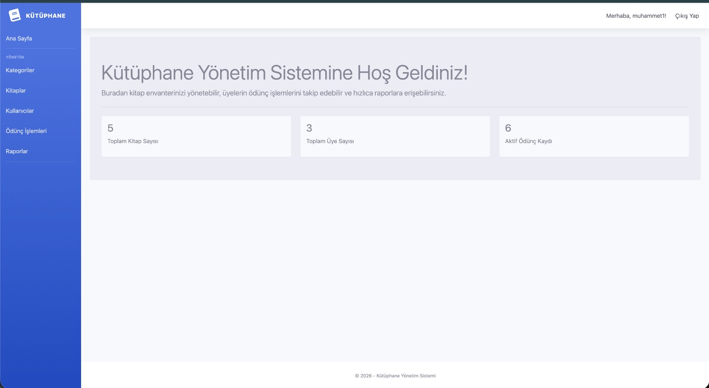
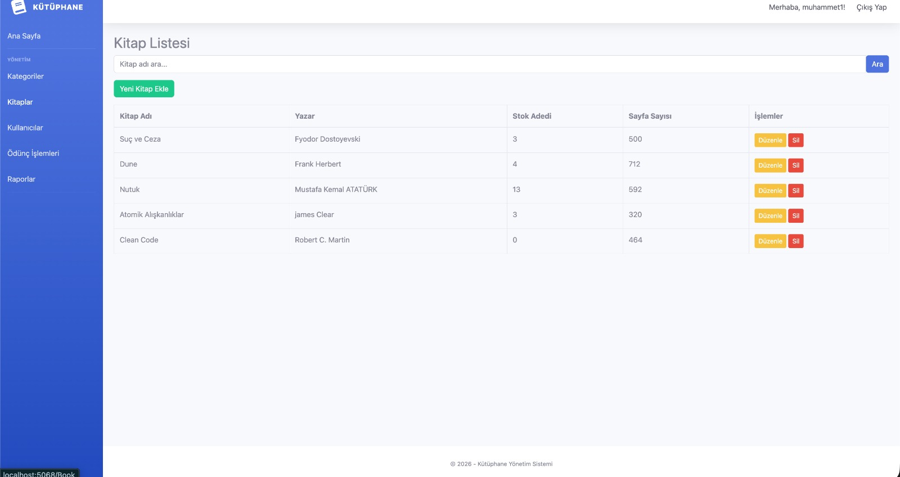
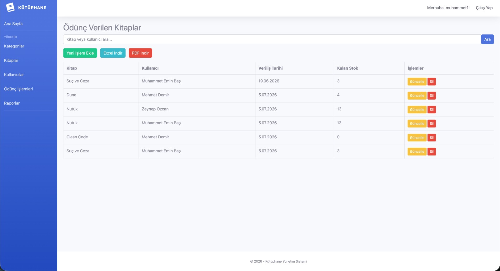
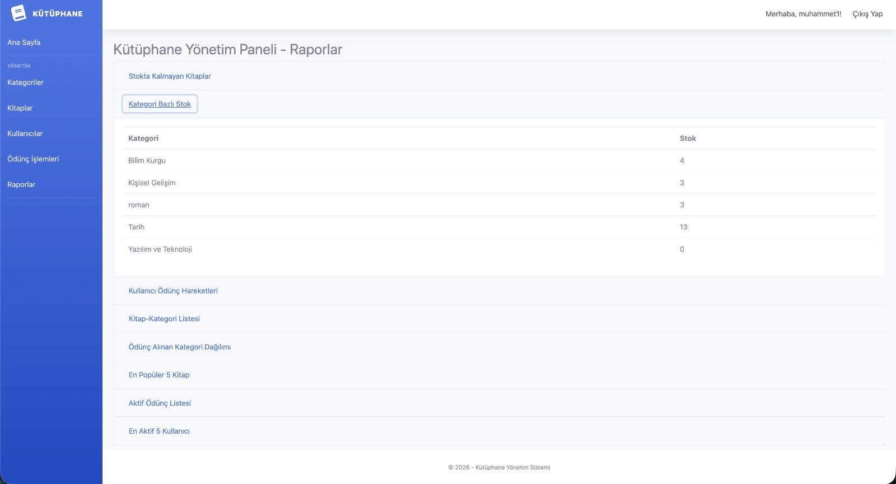
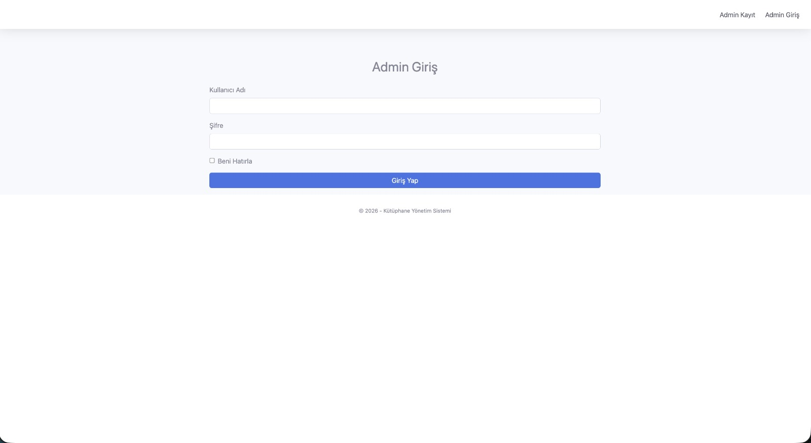

# Kütüphane Yönetim Sistemi 

<div align="center">
  
</div>

Bu proje, ASP.NET Core MVC mimarisi kullanılarak N-Katmanlı (N-Tier) yapıya uygun olarak geliştirilmiş kapsamlı bir Kütüphane Yönetim Sistemi'dir. Yönetici (Admin) işlemleri; kitap, kategori, kullanıcı (ödünç alanlar) ve ödünç verme hareketlerinin takibini kolaylaştırmayı amaçlamaktadır. 

## 🏗 Mimari Yapı (Katmanlar)

Proje, bağımlılıkları en aza indirmek ve sürdürülebilirliği artırmak için üç ana katmana ayrılmıştır:

1. **Kutuphane.Model (Core/Entities):** Veritabanı tablolarına karşılık gelen temel sınıf yapılarını (Book, Category, Loan, User) ve Identity için AdminUser sınıfını barındırır.
2. **Kutuphane.Data (Data Access):** Veritabanı bağlantısı, Entity Framework Core yapılandırması ve `ApplicationDbContext` sınıfını barındırır.
3. **KutuphaneUI (Presentation/Web):** Kullanıcıyla (Admin) etkileşimin sağlandığı ASP.NET Core MVC projesidir. View, Controller ve Middleware yapılandırmalarını içerir.

## ✨ Temel Özellikler

- **Admin Güvenliği (Identity):** `ASP.NET Core Identity` ile güvenli yönetim. Tüm sayfalar için global yetkilendirme.
- **Entegre Stok Takibi:** Ödünç verme durumunda otomatik stok düşümü, iadelerde stok artışı. Yetersiz stokta işlem engelleme.
- **Gelişmiş Raporlama:** Popüler kitaplar, aktif kullanıcılar ve kategori analizleri.
- **Excel & PDF Dışa Aktarım:** `ClosedXML` ve `QuestPDF` ile anlık rapor üretimi.
- **Modern Arayüz:** `SB Admin 2` Bootstrap teması ile profesyonel bir kullanıcı deneyimi.

## 💻 Kullanılan Teknolojiler

- **Backend:** C#, .NET 10.0
- **Framework:** ASP.NET Core MVC, Entity Framework Core
- **Kimlik Doğrulama:** ASP.NET Core Identity
- **Veritabanı:** SQL Server
- **Raporlama:** ClosedXML (Excel), QuestPDF (PDF)
- **Frontend:** Bootstrap 4 (SB Admin 2), jQuery, FontAwesome

## 📸 Ekran Görüntüleri

<div align="center">
  
  <br/><i>Admin Kontrol Paneli</i><br/><br/>

  
  <br/><i>Kitap Envanter Yönetimi</i><br/><br/>

  
  <br/><i>Ödünç Verme ve Stok Takip</i><br/><br/>

  
  <br/><i>Kategori Bazlı Raporlama Örneği</i><br/><br/>

  
  <br/><i>Güvenli Giriş Paneli</i>
</div>

## 🚀 Kurulum ve Çalıştırma

1. **Veritabanı Ayarları:**
   `KutuphaneUI` içerisindeki `appsettings.json` dosyasında bulunan `DefaultConnection` bağlantı dizesini (Connection String) kendi SQL Server yapılandırmanıza göre düzenleyin.

2. **Migration ve Veritabanı Oluşturma:**
   Package Manager Console veya Terminal üzerinden aşağıdaki komutu çalıştırarak veritabanını ve tabloları oluşturun:
   ```bash
   dotnet ef database update -p Kutuphane.Data/Kutuphane.Data.csproj -s KutuphaneUI/KutuphaneUI.csproj
   ```

3. **Projeyi Başlatma:**
   ```bash
   dotnet run --project KutuphaneUI/KutuphaneUI.csproj
   ```

4. **Kullanım:**
   - Proje başlatıldığında sistem sizi otomatik olarak `/Account/Login` sayfasına yönlendirecektir.
   - İlk kullanımda **"Admin Kayıt"** linkine tıklayarak kendinize yeni bir yönetici hesabı oluşturun.
   - Oluşturduğunuz hesapla giriş yaptıktan sonra kütüphane paneline tam erişim sağlayabilirsiniz.
