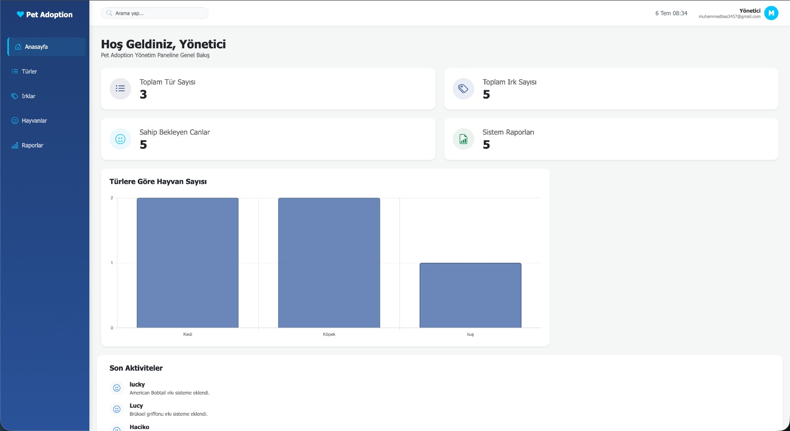
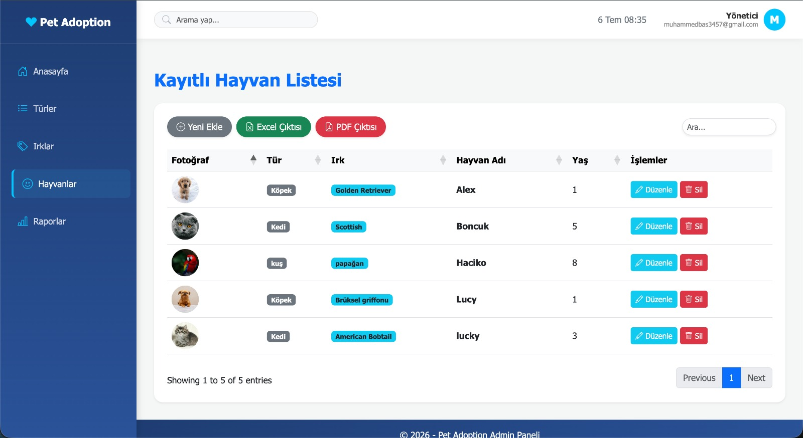
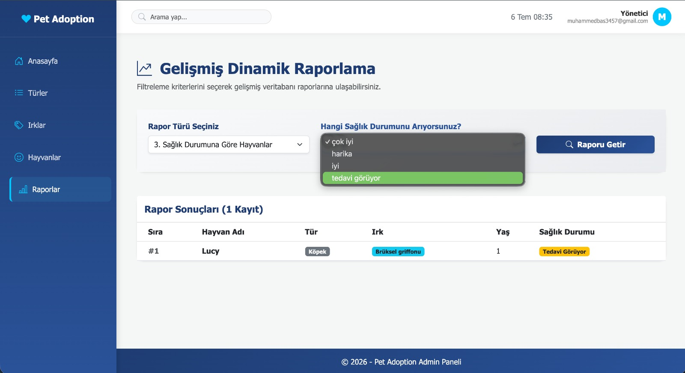
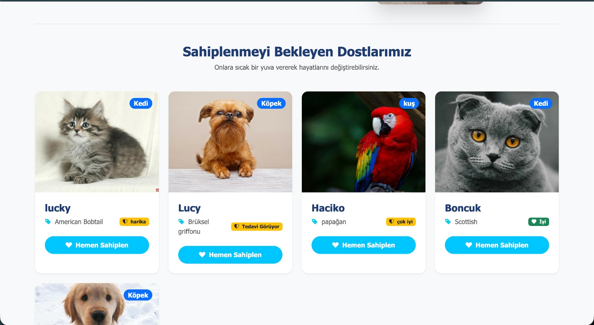
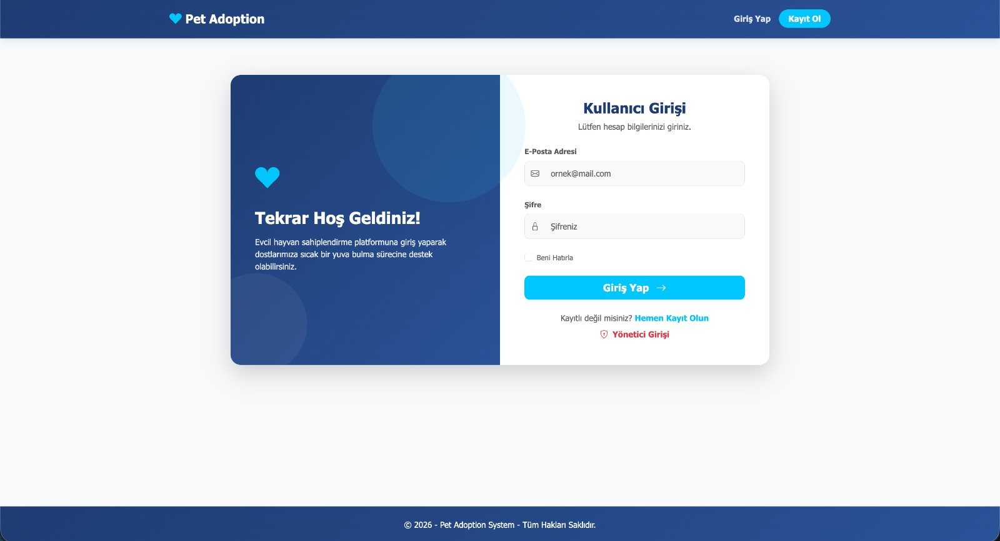
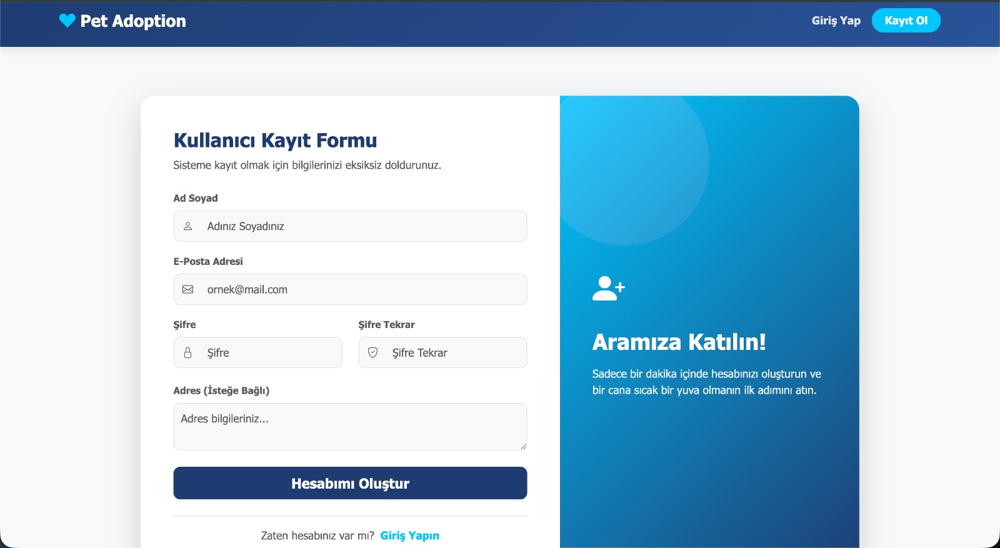

# PetAdoptionORM 🐾

Bu proje, **ASP.NET Core MVC** kullanılarak geliştirilmiş, **N-Katmanlı (N-Tier)** mimari prensipleri ile inşa edilmiş kurumsal bir "Evcil Hayvan Sahiplenme" sistemidir.

## 🏗 Mimari ve Teknolojiler

Proje, temiz kod (Clean Code) ve yüksek sürdürülebilirlik ilkeleriyle üç ana katmanda kurgulanmıştır:

- **PetAdoptionORM.Model (Domain Layer):** Varlıklar (Entities) ve veri transferi için kullanılan ViewModel yapıları.
- **PetAdoptionORM.Data (Data Access Layer):** **Repository** ve **Unit of Work** desenleri ile soyutlanmış; **Entity Framework Core** ile yönetilen veritabanı operasyonları.
- **PetAdoptionORM (Presentation Layer):** **Area** mimarisi (Admin/User) ile modüler hale getirilmiş, kullanıcı etkileşimini barındıran MVC web projesi.

### Kullanılan Temel Teknolojiler

- **Backend:** ASP.NET Core MVC, .NET
- **ORM:** Entity Framework Core (Code-First)
- **Veritabanı:** MS SQL Server
- **Güvenlik:** ASP.NET Core Identity
- **Loglama:** Serilog (Gelişmiş operasyonel günlükleme)

## 📸 Ekran Görüntüleri

<div align="center">
  <br/>
  <b>Dashboard</b><br/><br/>

<br/>
<b>Hayvanlar (CRUD)</b><br/><br/>

<br/>
<b>Örnek Raporlama Ekranı</b><br/><br/>

<br/>
<b>Hayvan Sahiplenme Ekranı (User)</b><br/><br/>

<br/>
<b>Kullanıcı Login Ekranı</b><br/><br/>

<br/>
<b>Kullanıcı Kayıt Ekranı</b><br/>

</div>
Diğer fotoğraflara screenshots klasöründen erieşebilirsiniz.

## 🚀 Kurulum ve Çalıştırma

1. **Bağlantı Ayarları:** `PetAdoptionORM` projesindeki `appsettings.json` içerisinden `Default` connection string'ini kendi SQL Server bilginize göre güncelleyin.
2. **Migration:** Veritabanı tablolarını otomatik oluşturun:
   ```bash
   dotnet ef database update --project PetAdoptionORM.Data --startup-project PetAdoptionORM
   ```
3. **Başlatma:**
   cd PetAdoptionORM
   dotnet run

   **Not**
   Proje, geliştirme aşamasında Identity şifre kurallarını minimumda (min. 3 karakter) tutacak şekilde yapılandırılmıştır. Production ortamına geçişte Program.cs üzerinden güvenlik politikalarının güncellenmesi önerilir.
