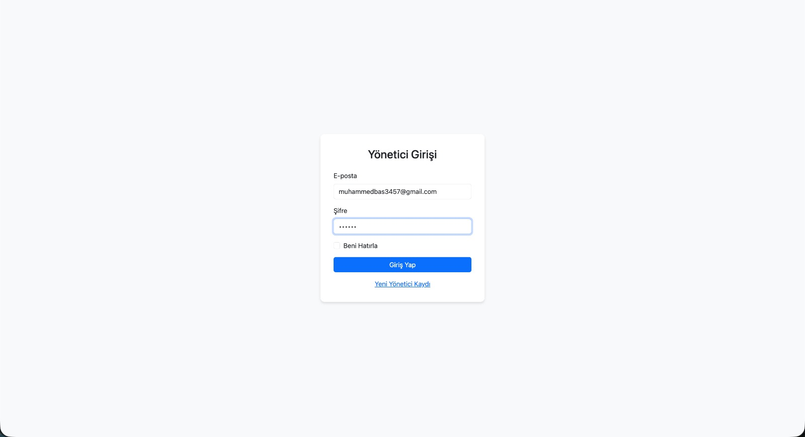

# Spor Salonu Yönetim Paneli (SporSalonApp)

Bu proje, ASP.NET Core **Razor Pages** mimarisi ile geliştirilmiş, minimalist ve performans odaklı bir Spor Salonu Yönetim Paneli uygulamasıdır. Üye takibi, ekipman yönetimi ve duyuru sistemini, yüksek güvenlikli bağımsız bir Identity altyapısı ile birleştirir.

## 🚀 Temel Özellikler

- **Güvenli Kimlik Doğrulama (Identity):** Bağımsız bir `identity.db` (SQLite) üzerinde çalışan ASP.NET Core Identity altyapısı ile yönetici erişimi.
- **Katmanlı Veri Yönetimi:** Proje verileri ile kimlik doğrulama verilerinin (Authentication) fiziksel olarak ayrıştırıldığı izole veritabanı mimarisi.
- **Rol Tabanlı Erişim:** Tüm kritik paneller `[Authorize(Roles = "Admin")]` özniteliği ile korunmaktadır.
- **İstemci Taraflı Optimizasyon:** Sunucu yükünü minimize eden, SheetJS ve html2pdf.js ile istemci tarafında (Client-side) gerçekleşen hızlı Excel ve PDF dışa aktarma modülü.
- **Modern Dashboard:** Bootstrap 5 ile güçlendirilmiş, koyu tonlarda (Sidebar #2C3E50) temiz ve kullanıcı dostu arayüz.

## 📁 Teknik Mimari

Proje, bağımsız modüller üzerine kurulu olup temel olarak şu sınıfları yönetir:

1. **Uye:** Üye kayıt ve iletişim bilgileri.
2. **Ekipman:** Envanter durumu ve satın alma takibi.
3. **Duyuru:** Üyelere yönelik bildirim mekanizması.

## 💻 Kullanılan Teknolojiler

- **Backend:** .NET 8.0/10.0, ASP.NET Core Razor Pages
- **Veritabanı:** SQLite (Identity için), Entity Framework Core
- **Arayüz:** Bootstrap 5, Custom CSS
- **İstemci Kütüphaneleri:** SheetJS (Excel Export), html2pdf.js (PDF Export)
- **Güvenlik:** ASP.NET Core Identity

## 📸 Ekran Görüntüleri

<div align="center">
  
  <br/><i>Login Ekranı </i><br/><br/>

  
  <br/><i>Üye Yönetimi ve Export Modülü</i><br/><br/>

  
  <br/><i>Ekipman Takip Sistemi</i><br/><br/>

  
  <br/><i>Ekipmanlar</i><br/><br/>

  
  <br/><i>Duyurular</i>
</div>

## 🚀 Adım Adım Nasıl Çalıştırılır?

Bu proje **ASP.NET Core Razor Pages** mimarisiyle ve veritabanı olarak **SQLite** kullanılarak geliştirilmiştir. Projeyi sorunsuz çalıştırmak için aşağıdaki adımları sırasıyla izleyin:

1. **Terminali Açma:**
   - Ana depo kök dizininde (`SOFTITO-BACKEND` klasörü içinde) bir terminal veya komut satırı açın.

2. **Veritabanı ve Migration İşlemleri:**
   - Proje SQLite kullandığı için genellikle bağlantı dizesi ayarı (SQL Server'daki gibi) gerektirmez. Ancak veritabanı dosyasının (örn: `identity.db`) ve tabloların oluşması için migration'ları uygulamanız gerekebilir:
   ```bash
   dotnet ef database update --project RazorPagesProject/SporSalonApp/SporSalonApp.csproj
   ```
   *(Eğer hazır bir db dosyanız varsa veya Entity Framework başlangıçta otomatik oluşturuyorsa bu adımı atlayabilirsiniz.)*

3. **Projeyi Başlatma:**
   - Aşağıdaki komutu çalıştırarak projeyi ayağa kaldırın:
   ```bash
   dotnet run --project RazorPagesProject/SporSalonApp/SporSalonApp.csproj
   ```

4. **Kullanım:**
   - Proje derlendikten sonra terminalde belirtilen `http://localhost:<port>` adresi üzerinden tarayıcınızda uygulamayı açabilirsiniz. Güvenlik gereği çoğu sayfaya erişim için yetkili (Admin) bir hesapla giriş yapmanız istenecektir.
