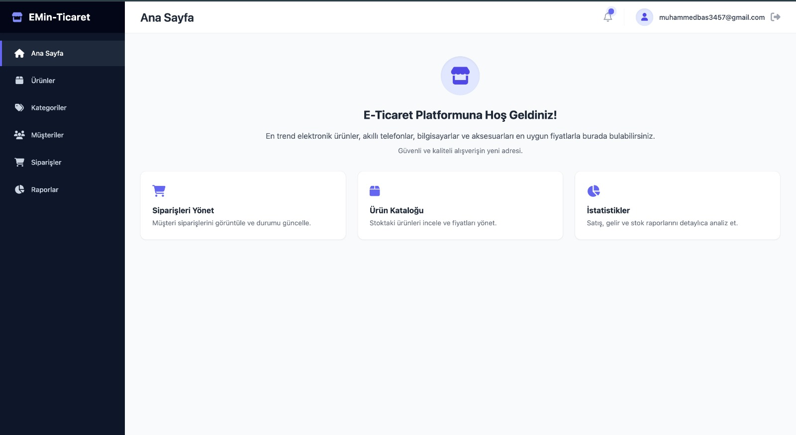
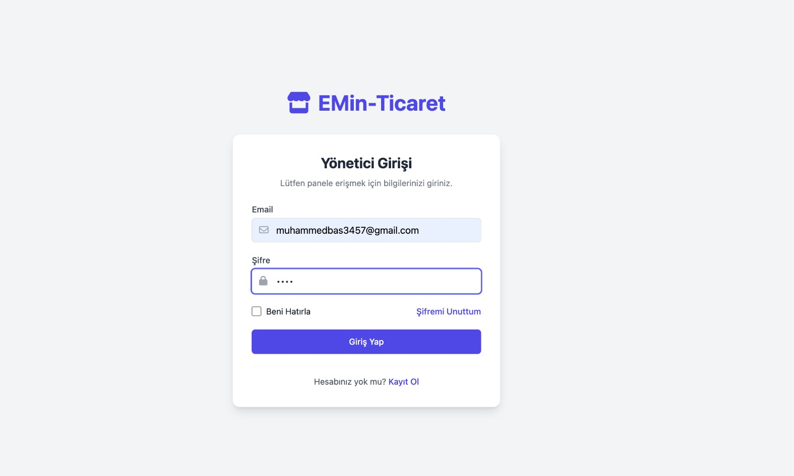
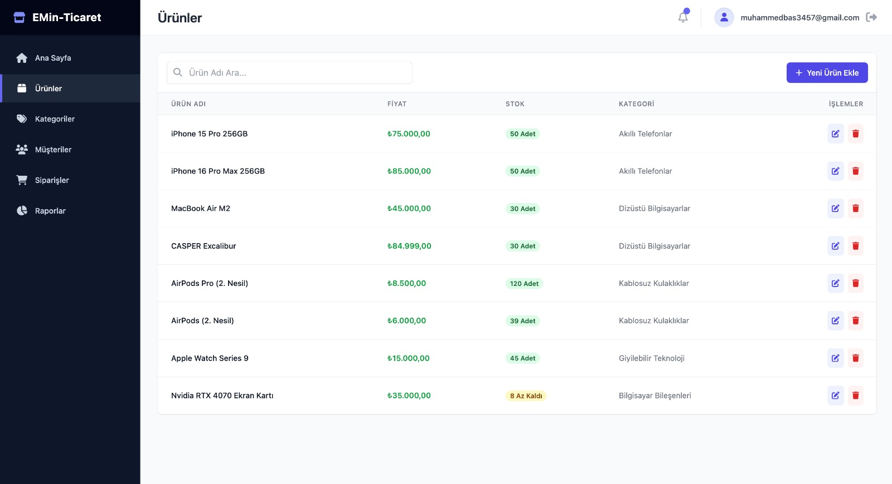
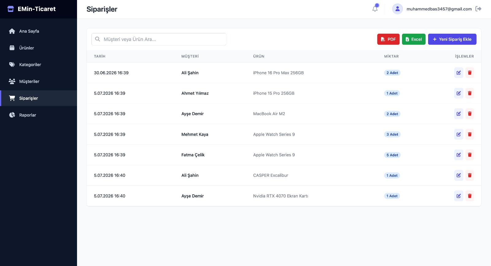
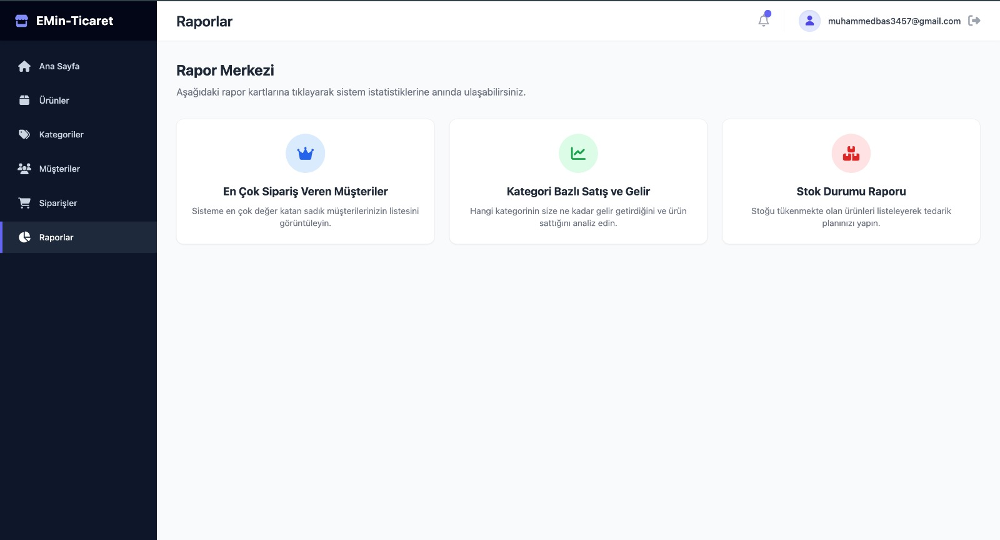

# B2B E-Ticaret Yönetim Paneli

İşletmelerin ürün stoklarını, siparişlerini, müşterilerini ve satış raporlarını tek bir merkezden yönetmelerini sağlayan, ASP.NET Core MVC mimarisi ile geliştirilmiş dinamik bir E-Ticaret Admin Dashboard projesidir. Sistem, ASP.NET Core Identity ile tamamen güvenli hale getirilmiş olup; yetkisiz erişimlere kapalı, oturum ve çerez (cookie) yönetimi barındıran profesyonel bir B2B altyapısı sunar.

## 💻 Kullanılan Teknolojiler
* C# .NET Core 8.0 (MVC)
* Entity Framework Core (Code-First Approach)
* MS SQL Server (Docker Container)
* ASP.NET Core Identity (Güvenli oturum yönetimi, şifre hashleme, yetkilendirme)

---

## 📸 Ekran Görüntüleri 

  
   
  <i>Modern Yönetici Paneli ve İstatistikler (Dashboard)</i>
    

  
   
  <i>Güvenli Kullanıcı Giriş Ekranı (Login)</i>
    

  
   
  <i>Katalog ve Ürün Yönetim Modülü</i>
    

  
   
  <i>Sipariş Takip ve Yönetim Ekranı</i>
    

  
   
  <i>Gelişmiş Satış ve Stok Raporları</i>

> 💡 **Not:** Projeye ait diğer tüm detaylı ekran görüntülerine yukarıdaki dosya listesinden `screenshots` klasörüne tıklayarak erişebilirsiniz.