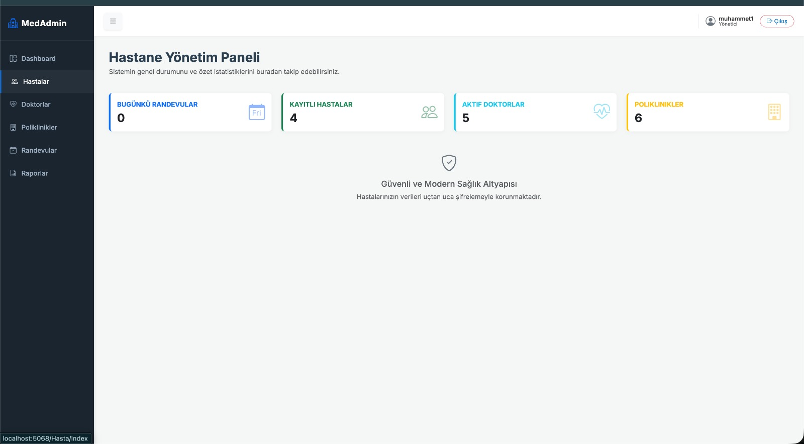
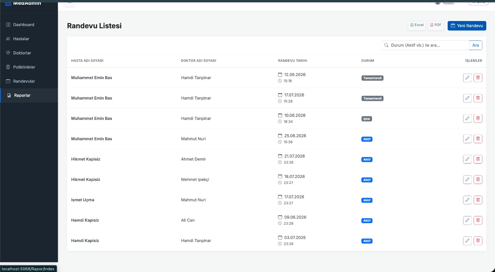
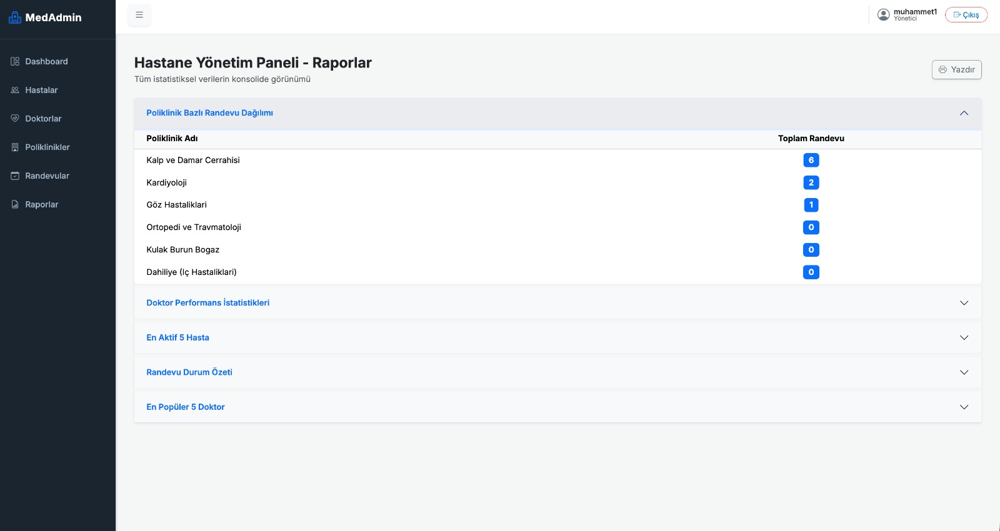
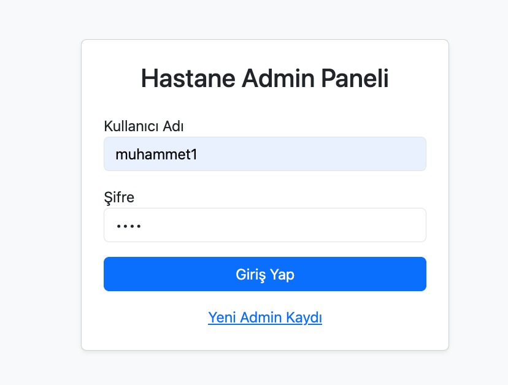

# Hastane Randevu Yönetim Sistemi (Admin Paneli)

Bu proje, **ASP.NET Core MVC** ve **Dapper** mikro-ORM teknolojileri kullanılarak geliştirilmiş, kurumsal "Medikal" temaya sahip gelişmiş bir Hastane Yönetim ve Randevu sistemidir.

## 🚀 Teknolojiler ve Altyapı

- **Backend:** .NET 10.0, ASP.NET Core MVC
- **Mikro-ORM:** Dapper (v2.1.79) ile performanslı veritabanı etkileşimi.
- **Veritabanı:** Microsoft SQL Server
- **Kimlik Doğrulama:** Cookie Authentication (Yetkilendirme tabanlı `[Authorize]`)
- **Performans:** `IMemoryCache` (Hızlı veri erişimi ve sorgu optimizasyonu)
- **Loglama:** Serilog (Dosya tabanlı detaylı izleme)
- **Raporlama:** `ClosedXML` (Excel) ve `QuestPDF` (PDF) entegrasyonu
- **Arayüz:** Bootstrap 5, Bootstrap Icons, Google Fonts (Inter)

## ✨ Öne Çıkan Özellikler

- **Otomatik Veritabanı Kurulumu:** Proje ilk çalıştığında `Program.cs` ve `Context.cs` üzerinden gerekli tabloları ve Stored Procedure'leri otomatik oluşturur.
- **Güvenli Erişim:** `/Admin/Login` ile zorunlu oturum yönetimi ve yetkisiz erişim engelleme.
- **Dinamik Dashboard:** Hastaneye ait anlık istatistiklerin (Hasta, Randevu, Doktor, Poliklinik) şık kartlarla sunulduğu bir kontrol paneli.
- **Yüksek Performanslı Arama:** Önbellek (Cache) mekanizması ile desteklenen, hızlı veri filtreleme ve CRUD işlemleri.
- **SQL Destekli Raporlama:** 5 farklı `Stored Procedure` üzerinden **JOIN** ve **GROUP BY** mantığıyla oluşturulan, Bootstrap Accordion yapısında sunulan detaylı raporlar.
- **Veri Dışa Aktarımı:** Randevu listelerinin anlık olarak temiz PDF veya Excel raporu olarak alınabilmesi.

## 📸 Ekran Görüntüleri

<div align="center">
  
  <br/><i>Modern Hastane Dashboard</i><br/><br/>

  
  <br/><i>Randevu Yönetim ve Arama Ekranı</i><br/><br/>

  
  <br/><i> Rapor Ekranı</i><br/><br/>

  
  <br/><i>Güvenli Yönetici Girişi</i>
</div>
Diğer ekran görüntülerine screenshots klasöründen erişebilirsiniz.
## 🛠 Kurulum ve Çalıştırma

1. **Bağlantı Ayarları:** `HastaneRandevu/Models/Context.cs` dosyasındaki `connectionstring` değerini kendi SQL Server bilgilerinizle güncelleyin.
2. **Derleme:**
   ```bash
   dotnet build
   ```
3. **Çalıştırma:**
   dotnet run
