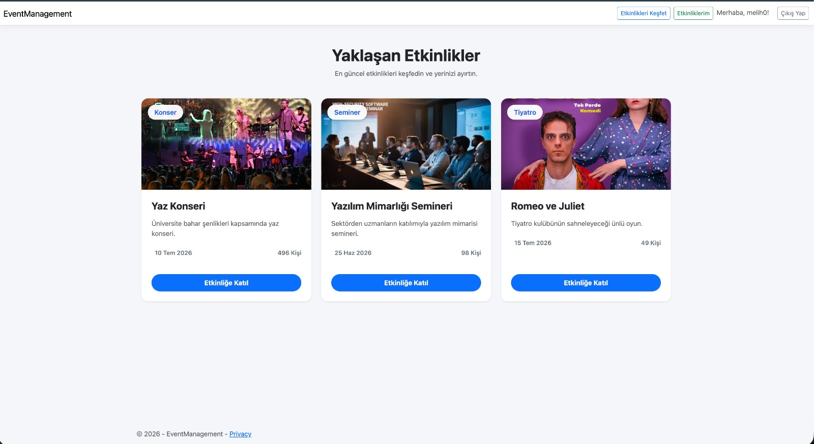
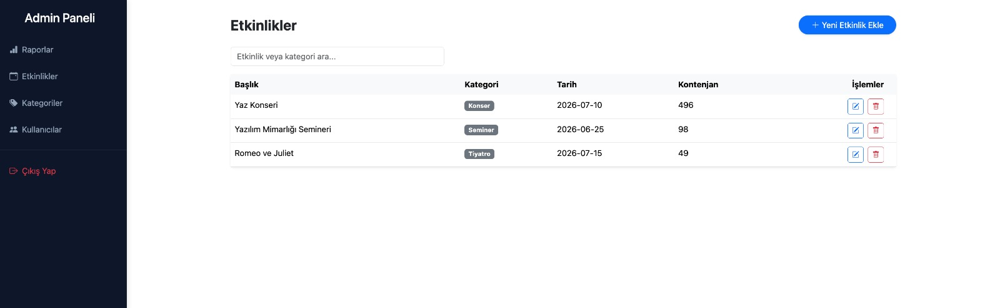
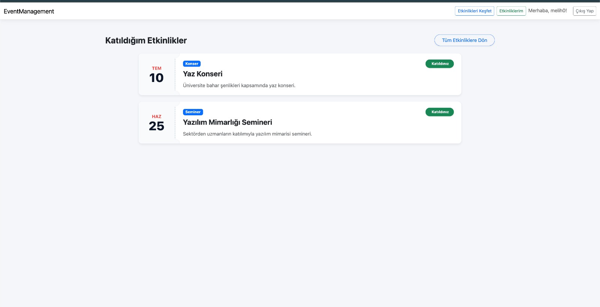

# Event Management System (Etkinlik Yönetim Sistemi)

  

Modern, dinamik ve kullanıcı dostu bir arayüze sahip olan bu proje; **ASP.NET Core MVC**, **Entity Framework Core**, **ASP.NET Core Identity** ve **jQuery/AJAX** teknolojileri kullanılarak geliştirilmiş kapsamlı bir Etkinlik Yönetim Sistemidir.

## 🚀 Proje Özellikleri

### 👥 Rol Bazlı Yetkilendirme (ASP.NET Core Identity)

Sistem **Admin** ve **User** olmak üzere iki ana yetki seviyesine sahiptir:

- **Admin:** Kapsamlı CRUD işlemleri, etkinlik yönetimi, kategori kontrolü ve detaylı dashboard erişimi.
- **User:** Etkinlikleri inceleme, kontenjan durumuna göre katılım sağlama ve "Etkinliklerim" sayfasından dijital bilet yönetimi.

### 💻 Teknolojiler ve Altyapı

- **Backend:** ASP.NET Core 10.0 MVC
- **ORM:** Entity Framework Core (Code First)
- **Kimlik Doğrulama:** ASP.NET Core Identity
- **Asenkron İletişim:** AJAX & jQuery (Sayfa yenilemeden veri operasyonları)
- **Loglama:** Serilog (Detaylı günlük hata ve işlem takibi)
- **Tasarım:** Bootstrap tabanlı responsive UI, dinamik modal yapıları

### ✨ Öne Çıkan Fonksiyonlar

- **Dinamik Modal Yönetimi:** Tüm CRUD işlemleri, sayfayı yenilemeden AJAX/jQuery destekli pop-up modallar üzerinden yürütülür.
- **Akıllı Kontenjan Takibi:** Etkinlik kapasiteleri veritabanı üzerinden anlık izlenir; dolu etkinlikler için katılım otomatik olarak kısıtlanır.
- **Kurumsal Raporlama:** İstatistiksel veriler (toplam etkinlik/kategori) anında dışa aktarılabilir formatta sunulur.
- **Dinamik Medya Yönetimi:** Admin panelinden yüklenen etkinlik görselleri kullanıcı arayüzüne otomatik entegre edilir.

## 📸 Ekran Görüntüleri

  
   <i>Admin Dashboard ve Raporlama</i>  

  
   <i>Etkinlikler (crud) </i>  

  
   <i>Kategoriler(crud)</i>  

  
   <i>Kullanıcıya özel Katıldığı etkinliklerin görüntülemeleri </i>  

Diğer ekran görüntülerine screenshots adlı klasörden ulaşabilirsiniz.
